

# Table of Contents
* [Updates](#updates)
* [About](#about)
* [Goals](#goals)
* [Approach](#approach)
* [Vocabulary Prefixes](#prefixes)
* [schema.org Extensions](#extensions)
* [Graphical Notation](#graphical-notation)
* [Publishing schema.org JSON-LD](#schemaorg-jsonld)
  * [Describing a Repository](#repository)
    * [Repository - Fields](#repository-fields)
    * [Repository - Funding Source](#repository-funding-source)
    * [Repository - Types of Resources](#repository-resource-types)
    * [Repository - Outreach Activities](#repository-outreach-activities)
    * [Repository - Identifier](#repository-identifier)
    * [Repository - Policies](#repository-policies)
    * [Repository - Services](#repository-services)
    * [Repository - Data Collections](#repository-data-collections)
  * [Describing a Dataset](#dataset-diagram)
    * [Dataset - Identifier](#dataset-identifiers)
    * [Dataset - Variables](#dataset-variables)
    * [Dataset - DataCatalog](#dataset-catalog)
    * [Dataset - Distributions](#dataset-distros)
       * [Accessing Data through a Service Endpoint](#dataset-service-endpoint)
    * [Dataset - Temporal](#dataset-temporal)
    * [Dataset - Spatial](#dataset-spatial)
      * [GeoCoordinates](#dataset-spatial-point)
      * [GeoShape](#dataset-spatial-shape)
    * [Dataset - Creators/Contributors](#dataset-creator_contributor)
    * [Dataset - Publisher/Provider](#dataset-publisher_provider)
    * [Dataset - Protocols](#dataset-protocols)
    * [Dataset - Funding](#dataset-funding)

* [Examples](#examples)
* [Issues](#issues)
* [Advanced Publishing Techniques](#advanced-publishing-techniques)
  * [How to use external vocabularies](#advanced-publishing-category)
  * [Publishing more detail for categories/disciplines for a repository](#advanced-publishing-category)

# UPDATES

**Mar 15 2018**

Adding the [schema:identifier](https://schema.org/identifier) field can be done in three ways - a text description, a URL, or by using the [schema:PropertyValue](https://schema.org/PropertyValue) type to describe the identifier in more detail. **We highly recommend using the [schema:PropertyValue](https://schema.org/PropertyValue) as the use of text or url does not get indexed properly by Google and other JSON-LD testing tools due to an issue with the properties definition.**

**Mar 1 2018**

We've updated our documentation for fixing our use of [schema:additionalType](https://schema.org/additionalType) and [schema:propertyID](https://schema.org/propertyID) to use fully-qualified URLs. This corrects the mistake of using a vocabulary prefix such as `gdx:` to make reference to a vocabulary class. An example of this fix for [schema:additionalType](https://schema.org/additionalType):

**OLD**
<pre>
{
  "@context": {
    "@vocab": "http://schema.org/",
    <strong>"gdx": "https://geodex.org/voc/"</strong>
  },
  ...
  <strong>"additionalType": "gdx:ResearchRepositoryService"</strong>
  ...
}
</pre>

**NEW**
<pre>
{
  "@context": {
    "@vocab": "http://schema.org/",
    <strong>"gdx": "https://geodex.org/voc/"</strong>
  },
  ...
  <strong>"additionalType": "https://geodex.org/voc/ResearchRepositoryService"</strong>
  ...
}
</pre>

This pattern is also applied to the [schema:propertyID](https://schema.org/propertyID) in this way:

**OLD**
<pre>
{
  "@context": {
    "@vocab": "http://schema.org/",
    <strong>"datacite": "http://purl.org/spar/datacite/"</strong>
  },
  ...
  "identifier": {
    "@type": "PropertyValue",
    <strong>"propertyID": "datacite:doi"</strong>,
    "value": "10.13039/100000141",
    "url": "https://doi.org/10.13039/100000141"
  },
}
</pre>

**NEW**
<pre>
{
  "@context": {
    "@vocab": "http://schema.org/",
    <strong>"datacite": "http://purl.org/spar/datacite/"</strong>
  },
  ...
  "identifier": {
    "@type": "PropertyValue",
    <strong>"propertyID": "http://purl.org/spar/datacite/doi"</strong>,
    "value": "10.13039/100000141",
    "url": "https://doi.org/10.13039/100000141"
  },
}
</pre>

## About

Serves the vocabulary in JSON-LD at https://geodex.org/voc/.

## Goals

1) To produce quality schema.org markup with additional extensions to schema.org classes to help improve harvesting technologies.

2) Produced markup will pass the [Google Structured Data Testing Tool](https://search.google.com/structured-data/testing-tool/u/0/) with 0 errors.

## Approach

The preferred format for schema.org markup by its harvesters is JSON-LD. For a primer on JSON-LD, see [https://json-ld.org/](https://json-ld.org/)

To produce quality schema.org, all extensions to schema.org classes will be made through the use of the recommended property [schema:additionalType](https://schema.org/additionalType).

The gdx: vocabulary will extend schema.org using rdfs:subClassOf in it's formal ontology, but in schema.org this doesn't translate into the use of JSON-LD's [@type](https://www.w3.org/TR/json-ld/#syntax-tokens-and-keywords) as traditional RDF publishing would encourage.

## Vocabulary Prefixes

| Prefix        | Vocabulary URI |
| ------------- |----------------|
| schema:       | [<https://schema.org/>](https://schema.org/) |
| gdx:          | [<https://geodex.org/voc/>](https://geodex.org/voc/) |
| geolink:      | [<http://schema.geolink.org/1.0/base/main#>](http://schema.geolink.org/1.0/base/main#) |
| earthcollab:  | [<https://library.ucar.edu/earthcollab/schema#>](https://library.ucar.edu/earthcollab/schema#) |
| vivo:         | [<http://vivoweb.org/ontology/core#>](http://vivoweb.org/ontology/core#) |
| geo-upper:    | [<http://www.geoscienceontology.org/geo-upper#>](http://www.geoscienceontology.org/geo-upper#) |
| datacite:      | [<http://purl.org/spar/datacite/>](http://purl.org/spar/datacite) |

[schema:](https://schema.org/) the defacto vocabulary for publishing structured data in web pages for search engine harvesting

[gdx:](https://geodex.org/voc/) the P418 project's vocabulary

[geolink:](http://schema.geolink.org/1.0/base/main) an EarthCube Building Block focusing on describing discovery-level metadata for datasets

[earthcollab:](https://library.ucar.edu/earthcollab/schema#) an EarthCube Building Block focusing on extensions to the ViVO ontology

[vivo:](http://vivoweb.org/ontology/core#) the ViVO ontology

[geo-upper:](http://www.geoscienceontology.org/geo-upper#) a segment of the Geoscience Standard Names Ontology, an EarthCube product. This ontology could be used when describing dataset variables.

[datacite:](http://purl.org/spar/datacite) describes persistent identifier schemes like DOI, ARK, URI for helping to represent PIDs.

## Schema.org Extensions
From P418, the vocabulary we built specifically for addressing gaps in schema.org and other EarthCube and community ontologies, we have:

**P418**: http://geodex.org/voc/
* Classes: http://geodex.org/voc/?show=classes
  * [gdx:ResearchRepositoryService](http://geodex.org/voc/ResearchRepositoryService)
* Properties: http://geodex.org/voc/?show=properties
  * [gdx:fundedBy](http://geodex.org/voc/fundedBy)
* NamedIndividuals (these are classes but tightly coupled to existing schema.org classes): http://geodex.org/voc/?show=namedindividuals
  * [gdx:OutreachActivities](http://geodex.org/voc/OutreachActivities)
  * [gdx:OutreachActivity-Training](http://geodex.org/voc/OutreachActivity-Training)
  * [gdx:OutreachActivity-UserSupport](http://geodex.org/voc/OutreachActivity-UserSupport)
  * [gdx:OutreachActivity-UserWorkshop](http://geodex.org/voc/OutreachActivity-UserWorkshop)
  * [gdx:Protocol-Access](http://geodex.org/voc/Protocol-Access)
  * [gdx:Protocol-License](http://geodex.org/voc/Protocol-License)
  * [gdx:Protocol-PreservationPolicy](http://geodex.org/voc/Protocol-PreservationPolicy)
  * [gdx:Protocol-ResourceSubmissionPolicy](http://geodex.org/voc/Protocol-ResourceSubmissionPolicy)
  * [gdx:Protocol-TermsOfUse](http://geodex.org/voc/Protocol-TermsOfUse)
  * [gdx:ResearchResourceTypes](http://geodex.org/voc/ResearchResourceTypes)
  * [gdx:SearchService](http://geodex.org/voc/SearchService)
  * [gdx:SitemapXML](http://geodex.org/voc/SitemapXML)
  * [gdx:SubmissionService](http://geodex.org/voc/SubmissionService)
  * [gdx:SyndicationService](http://geodex.org/voc/SyndicationService)

We also use terms from other vocabularies:

**GeoLink**
* Classes: [Dataset](http://schema.geolink.org/1.0/base/main#Dataset), [PhysicalSample](http://schema.geolink.org/1.0/base/main#PhysicalSample), [Identifier](http://schema.geolink.org/1.0/base/main#Identifier), [MeasurementType](http://schema.geolink.org/1.0/base/main#MeasurementType), [Person](http://schema.geolink.org/1.0/base/main#Person), [Organization](http://schema.geolink.org/1.0/base/main#Organization), [Award](http://schema.geolink.org/1.0/base/main#Award)

**EarthCollab**
* Classes: [Parameter](https://library.ucar.edu/earthcollab/schema#Parameter)

**ViVO** (part of EarthCollab)
* Classes: [Dataset](http://vivoweb.org/ontology/core#Dataset)

**GeoStandardNames**
* Classes: we give an example of how to use one of his terms (http://www.geoscienceontology.org/geo-lower/quantity#longitude)

**DataCite**
* Classes: [Identifier](https://sparontologies.github.io/datacite/current/datacite.html#d4e416)
* NamedIndividual: [DOI](https://sparontologies.github.io/datacite/current/datacite.html#d4e756), [ORCID](https://sparontologies.github.io/datacite/current/datacite.html#d4e1116)

## Graphical Notation

The graphs display the classes, properties and literals for producing valid schema.org markup.

[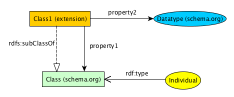](#)

Back to [top](#top)

## Schema.org JSON-LD

Schema.org's preferred format for markup is JSON-LD. THere are a number of tools that will help build valid schema.org JSON-LD.
* Web UI for constructing schema.org: [https://schema.pythonanywhere.com/](https://schema.pythonanywhere.com/)
  * Jumpstart into specific Types:
    * [Service](https://schema.pythonanywhere.com/Service)
    * [Organization](https://schema.pythonanywhere.com/Organization)
      * [ContactPoint](https://schema.pythonanywhere.com/ContactPoint)
      * [PropertyValue](https://schema.pythonanywhere.com/PropertyValue) aka Identifier
    * [DigitalDocument](https://schema.pythonanywhere.com/DigitalDocument)
    * [OfferCatalog](https://schema.pythonanywhere.com/OfferCatalog)
    * [ServiceChannel](https://schema.pythonanywhere.com/ServiceChannel)
      * [Service](https://schema.pythonanywhere.com/Service)
    * [Dataset](https://schema.pythonanywhere.com/Dataset)
      * [DataDownload](https://schema.pythonanywhere.com/DataDownload)
      * [DataCatalog](https://schema.pythonanywhere.com/DataCatalog)
      * [Person](https://schema.pythonanywhere.com/Person) aka Author/Contributor
      * [Organization](https://schema.pythonanywhere.com/Organization) aka Publisher, Provider, Funder
      * [Place](https://schema.pythonanywhere.com/Place)
        * [GeoShape](https://schema.pythonanywhere.com/GeoShape)
        * [GeoCoordinates](https://schema.pythonanywhere.com/GeoCoordinates)
      * [PropertyValue](https://schema.pythonanywhere.com/PropertyValue) aka Variable, Identifier
      * [Event](https://schema.pythonanywhere.com/Event)
        * [CreativeWork](https://schema.pythonanywhere.com/CreativeWork)
          * [Vehicle](https://schema.pythonanywhere.com/Vehicle)

* Google Testing Tool for schema.org: [https://search.google.com/structured-data/testing-tool/u/0/](https://search.google.com/structured-data/testing-tool/u/0/)
  * Error Guide: [https://www.schemaapp.com/tips/structured-data-testing-tool-error-guide/](https://www.schemaapp.com/tips/structured-data-testing-tool-error-guide/)

Back to [top](#top)

## Describing a Repository

[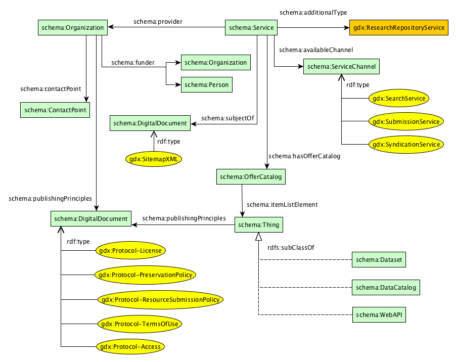](#)
In schema.org, we model a repository as both an [schema:Organization](https://schema.org/Organization) and a [schema:Service](https://schema.org/Service). This double-typing gives us the most flexibility in describing the characteristics of the organization providing the service and the services offered by the organization. Becuase the Service class in schema.org is very broad, to uniquely identify repositories curating research products, this vocabulary defines an extension to [schema:Service](https://schema.org/Service) as [gdx:ResearchRepositoryService](https://geodex.org/voc/ResearchRepositoryService).

<pre>
{
  "@context": {
    "@vocab": "http://schema.org/",
    "gdx": "https://geodex.org/voc/"
  },
  <strong>"@type": ["Service", "Organization"],
  "additionalType": "https://geodex.org/voc/ResearchRepositoryService"</strong>,
  "legalName": "Sample Data Repository Office",
  "name": "SDRO"
  </strong>
}
</pre>

The other fields you can use to describe the Organziation and the Service are:

[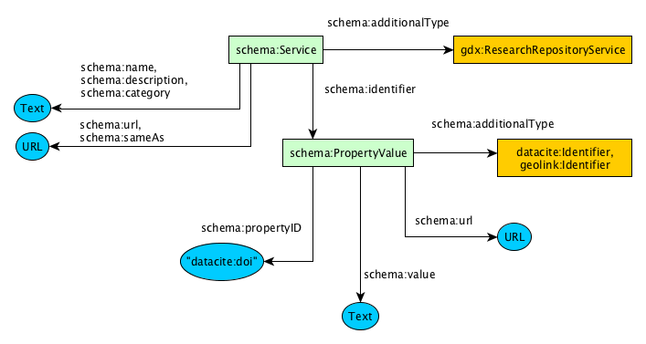](#)

* [schema:legalName](https://schema.org/legalName) should be the official name of the  repository,
* [schema:name](https://schema.org/name) can be an acronym or the name typcially used for the repository,
* [schema:url](https://schema.org/url) should be the url of your repository's homepage,
* [schema:description](https://schema.org/description) should be text describing your repository,
* [schema:sameAs](https://schema.org/sameAs) can be used to link the repository to other URLs such as Re3Data, Twitter, LinkedIn, etc.,
* [schema:category](https://schema.org/category) can be used to describe the discipline, domain, area of study that encompasses the repository's holdings.

<pre>
{
  "@context": {
    "@vocab": "http://schema.org/",
    "gdx": "https://geodex.org/voc/"
  },
  "@type": ["Service", "Organization"],
  "additionalType": "https://geodex.org/voc/ResearchRepositoryService",
  "legalName": "Sample Data Repository Office",
  "name": "SDRO",
  <strong>"url": "https://www.sample-data-repository.org",
  "description": "The Sample Data Repository Service provides access to data from an imaginary domain accessible from this website.",
  "sameAs": [
        "http://www.re3data.org/repository/r3d1000000xx",
        "https://twitter.com/SDRO",
        "https://www.linkedin.com/company/123456789/"
    ],
  "category": [
    "Biological Oceanography",
    "Chemical Oceanography"
  ]</strong>
}
</pre>

(See [advanced publishing techniques](#advanced-publishing) for how to [describe categories/disciplines in more detail](#advanced-publishing-category) than just simple text.)

If you are using the "@id" attribute for your Repository, you can specify the [schema:provider](https://schema.org/provider)  of the [schema:Service](https://schema.org/Service) in this way:
<pre>
{
  "@context": {
    "@vocab": "http://schema.org/",
    "gdx": "https://geodex.org/voc/"
  },
  "@type": ["Service", "Organization"],
  <strong>"@id": "https://www.sample-data-repository.org",</strong>
  "additionalType": "https://geodex.org/voc/ResearchRepositoryService",
  "legalName": "Sample Data Repository Office",
  "name": "SDRO",
  "url": "https://www.sample-data-repository.org",
  "description": "The Sample Data Repository Service provides access to data from an imaginary domain accessible from this website.",
  "category": [
    "Biological Oceanography",
    "Chemical Oceanography"
  ],
  <strong>"provider": {
    "@id": "https://www.sample-data-repository.org"
  }</strong>
}
</pre>

However, if your repository has a situation where multiple organizations act as the provider or you want to recognize a different organization as the provider of the repository's service, [schema:provider](https://schema.org/provider) can be used in this way:

<pre>
{
  "@context": {
    "@vocab": "http://schema.org/",
    "gdx": "https://geodex.org/voc/"
  },
  "@type": ["Service", "Organization"],
  "additionalType": "https://geodex.org/voc/ResearchRepositoryService",
  "legalName": "Sample Data Repository Office",
  "name": "SDRO",
  "url": "https://www.sample-data-repository.org",
  "description": "The Sample Data Repository Service provides access to data from an imaginary domain accessible from this website.",
  "category": [
    "Biological Oceanography",
    "Chemical Oceanography"
  ],
  <strong>"provider": [
    {
      "@type": "Organization",
      "name": "SDRO Technical Office",
      "description": "We provide all the infrastructure for the SDRO"
      ...
    },
    {
      "@type": "Organization",
      "name": "SDRO Science Support Office",
      "description": "We provide all the science support functionality for the SDRO"
      ...
    }
  ]</strong>
}
</pre>

Adding additional fields of [schema:Organization](https://schema.org/Organization):

<pre>
{
  "@context": {
    "@vocab": "http://schema.org/",
    "gdx": "https://geodex.org/voc/"
  },
  "@type": ["Service", "Organization"],
  "additionalType": "https://geodex.org/voc/ResearchRepositoryService",
  "legalName": "Sample Data Repository Office",
  "name": "SDRO",
  "url": "https://www.sample-data-repository.org",
  "description": "The Sample Data Repository Service provides access to data from an imaginary domain accessible from this website.",
  "category": [
    "Biological Oceanography",
    "Chemical Oceanography"
  ],
  "provider": {
    "@id": "https://www.sample-data-repository.org"
  }
  <strong>"logo": {
    "@type": "ImageObject",
    "url": "https://www.sample-data-repository.org/images/logo.jpg"
  },
  "contactPoint": {
    "@type": "ContactPoint",
    "name": "Support",
    "email": "info@bco-dmo.org",
    "url": "https://www.sample-data-repository.org/about-us",
    "contactType": "customer support"
  },
  "foundingDate": "2006-09-01",
  "address": {
    "@type": "PostalAddress",
    "streetAddress": "123 Main St.",
    "addressLocality": "Anytown",
    "addressRegion": "ST",
    "postalCode": "12345",
    "addressCountry": "USA"
  }</strong>
}
</pre>

If this Organization has a parent entity such as a college, university or research center, that information can be provided using the [schema:parentOrganization](https://schema.org/parentOrganization) property:

<pre>
{
  "@context": {
    "@vocab": "http://schema.org/",
    "gdx": "https://geodex.org/voc/"
  },
  "@type": ["Service", "Organization"],
  "additionalType": "https://geodex.org/voc/ResearchRepositoryService",
  "legalName": "Sample Data Repository Office",
  "name": "SDRO",
  "url": "https://www.sample-data-repository.org",
  "description": "The Sample Data Repository Service provides access to data from an imaginary domain accessible from this website.",
  "category": [
    "Biological Oceanography",
    "Chemical Oceanography"
  ],
  "provider": {
    "@id": "https://www.sample-data-repository.org"
  },
   <strong>"parentOrganization": {
     "@type": "Organization",
     "@id": "http://www.someinstitute.edu",
     "legalName": "Some Institute",
     "name": "SI",
     "url": "http://www.someinstitute.edu",
     "address": {
       "@type": "PostalAddress",
       "streetAddress": "234 Main St.",
       "addressLocality": "Anytown",
       "addressRegion": "ST",
       "postalCode": "12345",
       "addressCountry": "USA"
     }
   }</strong>
  }
}
</pre>

Back to [top](#top)

### Describing a Repository's Funding Source

To describe the funding source of a repository, you use the [schema:funder](https://schema.org/funder) property of [schema:Organization](https://schema.org/Organization):

<pre>
{
  "@context": {
    "@vocab": "http://schema.org/",
    "gdx": "https://geodex.org/voc/"
  },
  "@type": ["Service", "Organization"],
  "additionalType": "https://geodex.org/voc/ResearchRepositoryService",
  "legalName": "Sample Data Repository Office",
  "name": "SDRO",
  "url": "https://www.sample-data-repository.org",
  "description": "The Sample Data Repository Service provides access to data from an imaginary domain accessible from this website.",
  "category": [
    "Biological Oceanography",
    "Chemical Oceanography"
  ],
  "provider": {
    "@id": "https://www.sample-data-repository.org"
  },
   "parentOrganization": {
     "@type": "Organization",
     "@id": "http://www.someinstitute.edu",
     "legalName": "Some Institute",
     "name": "SI",
     "url": "http://www.someinstitute.edu",
     "address": {
       "@type": "PostalAddress",
       "streetAddress": "234 Main St.",
       "addressLocality": "Anytown",
       "addressRegion": "ST",
       "postalCode": "12345",
       "addressCountry": "USA"
     },
     <strong>"funder": {
      "@type": "Organization",
      "@id": "https://dx.doi.org/10.13039/100000141",
      "legalName": "Division of Ocean Sciences",
      "alternateName": "OCE",
      "url": "https://www.nsf.gov/div/index.jsp?div=OCE",
      "identifier": {
        "@type": "PropertyValue",
        "propertyID": "http://purl.org/spar/datacite/doi",
        "value": "10.13039/100000141",
        "url": "https://doi.org/10.13039/100000141"
      },
      "parentOrganization": {
        "@type": "Organization",
        "@id": "http://dx.doi.org/10.13039/100000085",
        "legalName": "Directorate for Geosciences",
        "alternateName": "NSF-GEO",
        "url": "http://www.nsf.gov",
        "identifier": {
          "@type": "PropertyValue",
          "propertyID": "http://purl.org/spar/datacite/doi",
          "value": "10.13039/100000085",
          "url": "https://doi.org/10.13039/100000085"
         },
        "parentOrganization": {
          "@type": "Organization",
          "@id": "http://dx.doi.org/10.13039/100000001",
          "legalName": "National Science Foundation",
          "alternateName": "NSF",
          "url": "http://www.nsf.gov",
          "identifier": {
            "@type": "PropertyValue",
            "propertyID": "http://purl.org/spar/datacite/doi",
            "value": "10.13039/100000001",
            "url": "https://doi.org/10.13039/100000001"
          }
        }
      }</strong>
    }
  }
}
</pre>

### Describing a Repository's Identifier

Some organizations may have a persistent identifier (DOI) assigned to their organization from authorities like the Registry of Research Data Repositories (re3data.org). The way to describe these organizational identifiers is to use the [schema:identifier](https://schema.org/identifier) property in this way:

<pre>
{
  "@context": {
    "@vocab": "http://schema.org/",
    "gdx": "https://geodex.org/voc/",
    <strong>"datacite": "http://purl.org/spar/datacite/"</strong>
  },
  "@type": ["Service", "Organization"],
  "additionalType": "https://geodex.org/voc/ResearchRepositoryService",
  "legalName": "Sample Data Repository Office",
  "name": "SDRO",
  "url": "https://www.sample-data-repository.org",
  "description": "The Sample Data Repository Service provides access to data from an imaginary domain accessible from this website.",
  "category": [
    "Biological Oceanography",
    "Chemical Oceanography"
  ],
  "provider": {
    "@id": "https://www.sample-data-repository.org"
  },
  <strong>"identifier": {
    "@type": "PropertyValue",
    "name": "Re3data DOI for this repository",
    "propertyID": "http://purl.org/spar/datacite/doi",
    "value": "10.17616/R37P4C",
    "url": "http://doi.org/10.17616/R37P4C"
  }</strong>
}
</pre>

We add the `datacite` vocabulary to the `@context` because the Datacite Ontology available at [http://purl.org/spar/datacite/](http://purl.org/spar/datacite/) has URIs to describe a DOI, ORCiD, ARK, URI, URN - all identifier scheme that help for disamiguating identifiers. To properly disambiguate a globally unique identifier, 2 pieces of information are needed - 1) the identifier value and 2) the scheme that on which that identifier exists. Some examples of this concept for common identifiers  are:

| Scheme | Value |
| ------ | ----- |
| DOI    | 10.17616/R37P4C |
| ORCiD  | 0000-0002-6059-4651 |

When describing PIDs, it's important to include both of these pieces for downstream activities like searching and linking resources. FOor example, a user may want to query for all repositories with a DOI identifier or all Datasets authored by a researcher with an ORCiD. These types of filters become more difficult when only the URL to these identifiers are provided. The reason here is that there are multiple URLs for an persistent identifier. On example is the DOI:

* http://doi.org/10.17616/R37P4C
* https://doi.org/10.17616/R37P4C
* http://dx.doi.org/10.17616/R37P4C
* https://dx.doi.org/10.17616/R37P4C

So, the best practice is to provide the scheme and value for an identifier, but you can also provide a URL representation using the [schema:url](https://schema.org/url) property.

Back to [top](#top)

### Describing a Repository's Types of Resources

[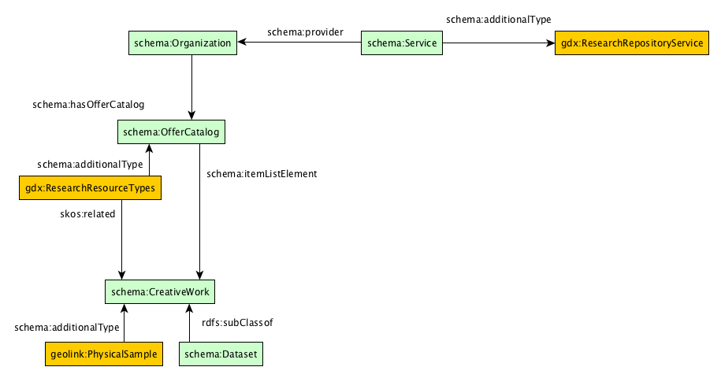](#)

To describe the types of research resources a repository curates, we use the [schema:OfferCatalog](https://schema.org/OfferCatalog). With an extension of gdx:ResearchResourceTypes, we define that the OfferCatalog will be a list of types that are dervied from [schema:CreativeWork](https://schema.org/CreativeWork).

<pre>
{
  "@context": {
    "@vocab": "http://schema.org/",
    "gdx": "https://geodex.org/voc/",
    "datacite": "http://purl.org/spar/datacite/",
    <strong>"geolink": "http://schema.geolink.org/1.0/base/main#",
    "schema": "http://schema.org/"</strong>
  },
  "@type": ["Service", "Organization"],
  "additionalType": "https://geodex.org/voc/ResearchRepositoryService",
  "legalName": "Sample Data Repository Office",
  "name": "SDRO",
  "url": "https://www.sample-data-repository.org",
  ...
  <strong>"hasOfferCatalog":{
    "@type": "OfferCatalog",
    "additionalType": "https://geodex.org/voc/ResearchResourceTypes",
    "itemListElement": [
      {"@type": "Thing", "@id": "schema:Dataset", "name": "Dataset"},
      {"@type": "Thing", "@id": "geolink:PhysicalSample", "name": "Physical Sample" }
    ]
  }</strong>
}
</pre>

Notice, that we use `@id` to describe the type of resource. To reference schema.org classes using `@id` properly, we must add schema.org to the `@context` with a prefix name. Here, we chose `schema:` in the `@context`, thus we use `schema:Dataset` to say that our repository curates resource types of [schema.org/Dataset](https://schema.org/Dataset).

Because schema.org does not have a class for a Physical Sample yet, we use teh calss definition from the [EarthCube GeoLink vocabulary](http://schema.geolink.org) to specify that this repository curates physical samples. We add `geolink:` to the `@context` section, and then specify `geolink:PhysicalSample` as another `@id` offered by this repository.

### Describing a Repository's Outreach Activities

[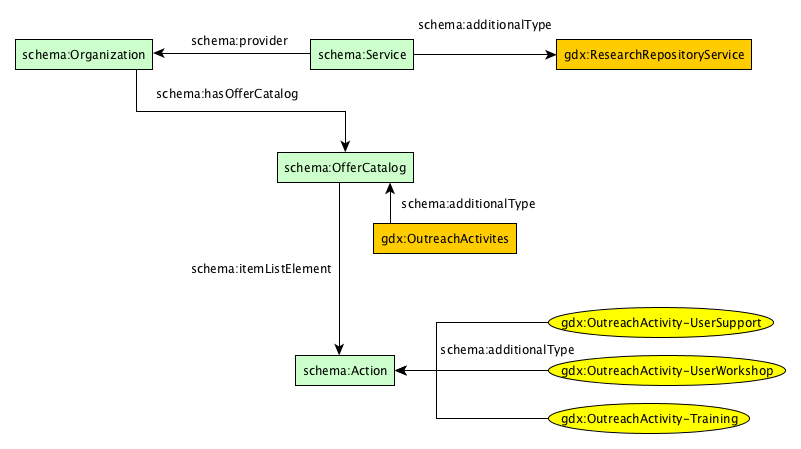](#)

To describe the outreach activities of a repository, we again use the [schema:OfferCatalog](https://schema.org/OfferCatalog) but specify it's [schema:additionalType](https://schema.org/additionalType) to be `gdx:OutreachActivities`:

<pre>
{
  "@context": {
    "@vocab": "http://schema.org/",
    "gdx": "https://geodex.org/voc/",
    "datacite": "http://purl.org/spar/datacite/",
    "geolink": "http://schema.geolink.org/1.0/base/main#",
    "schema": "http://schema.org/"
  },
  "@type": ["Service", "Organization"],
  "additionalType": "https://geodex.org/voc/ResearchRepositoryService",
  "legalName": "Sample Data Repository Office",
  "name": "SDRO",
  "url": "https://www.sample-data-repository.org",
  ...
  <strong>"hasOfferCatalog":[</strong>
    {
      "@type": "OfferCatalog",
      "additionalType": "https://geodex.org/voc/ResearchResourceTypes",
      "itemListElement": [
        {"@type": "Thing", "@id": "schema:Dataset", "name": "Dataset"},
        {"@type": "Thing", "@id": "geolink:PhysicalSample", "name": "Physical Sample" }
      ]
    },
    <strong>{
      "@type": "OfferCatalog",
      "additionalType": "https://geodex.org/voc/OutreachActivities",
      "itemListElement": [
        {
          "@type": "Action",
          "@id": "gdx:OutreachActivity-Training",
          "additionalType": "https://geodex.org/voc/OutreachActivity-Training",
          "name": "User Training",
          "description": "...",
          "url": "https://sample-data-repository.org/training/user-training"
        },
        {
          "@type": "Action",
          "@id": "gdx:OutreachActivity-UserWorkshop",
          "additionalType": "https://geodex.org/voc/OutreachActivity-UserWorkshop",
          "name": "User Workshops",
          "description": "...",
          "url": "https://sample-data-repository.org/workshops/data-submission-workshops"
        },
        {
          "@type": "Action",
          "@id": "gdx:OutreachActivity-UserSupport",
          "additionalType": "https://geodex.org/voc/OutreachActivity-UserSupport",
          "name": "User Support",
          "description": "...",
          "url": "https://sample-data-repository.org/support/user-support"
        },
      ]
    }</strong>
}
</pre>

These `Action` items above are not instances of actual events, but specify the type of potential events a repository may hold. To describe a specific [schema:Event](https://schema.org/Event) related to one of these activities, you could publish on a different web page in this way:

<pre>
{
  "@context": { "@vocab": "http://schema.org/" },
  "@type": "Event",
  "name": "SDRO Data Submission Workshop - Summer 2018",
  "url": "https://sample-data-repository.org/workshops/data-submission-workshops/summer-2018",
  <strong>"about": { "@id": "gdx:OutreachActivity-UserSupport" }</strong>
  ... goes on to describe the schema.org/Event
}
</pre>

### Describing a Repository's Policies

[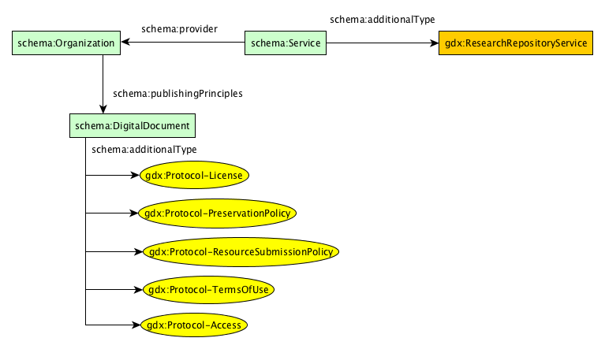](#)

If your repository has policy documents about access control, terms of use, etc. You can provide those using the [schema:publishingPrinciples](https://schema.org/publishingPrinciples) field. Becuase schema.org does not make a distiction for the types of these documents, P418 has created some class names for some common policy document types. These will help make it clear to users what types of policies you have. If you would like us to add more, please let us know by creating an [Issue](https://github.com/earthcubearchitecture-project418/p418Vocabulary/issues/new).

<pre>
{
  "@context": {
    "@vocab": "http://schema.org/",
    "gdx": "https://geodex.org/voc/",
    "datacite": "http://purl.org/spar/datacite/"
  },
  "@type": ["Service", "Organization"],
  "additionalType": "https://geodex.org/voc/ResearchRepositoryService",
  "legalName": "Sample Data Repository Office",
  "name": "SDRO",
  "url": "https://www.sample-data-repository.org",
  ...
  <strong>"publishingPrinciples": [
      {
        "@type": "DigitalDocument",
        "additionalType": "https://geodex.org/voc/Protocol-TermsOfUse",
        "name": "Terms of Use",
        "url": "https://www.sample-data-repository.org/terms-of-use",
        "fileFormat": "text/html"
      },
      {
        "@type": "DigitalDocument",
        "additionalType": "https://geodex.org/voc/Protocol-ResourceSubmissionPolicy",
        "name": "How to Get Started Contributing Data",
        "url": "https://www.sample-data-repository.org/submit-data",
        "fileFormat": "text/html"
      }
    ],
  ]</strong>
}
</pre>

Back to [top](#top)

### Describing a Repository's Services

[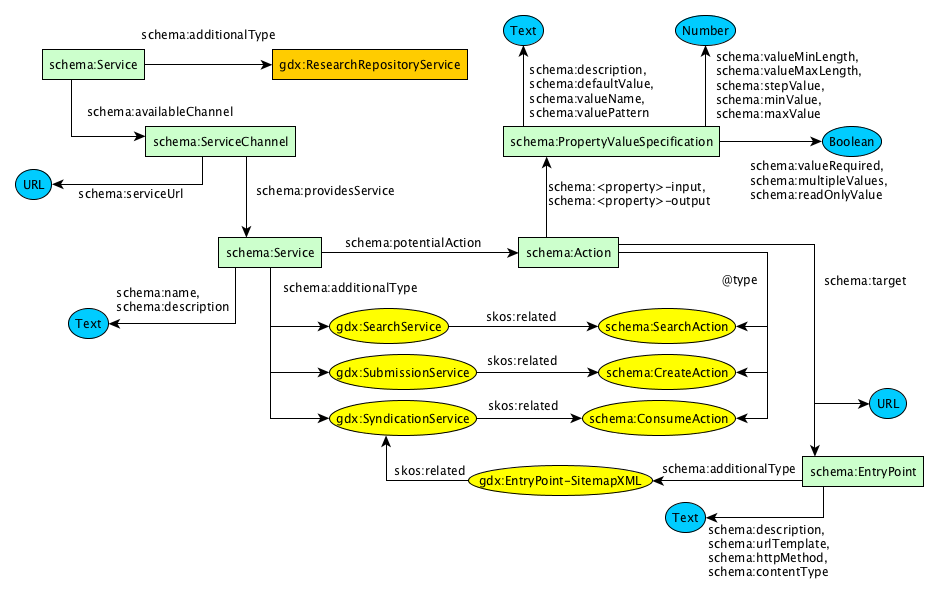](#)

For repositories might offer services for accessing data as opposed to directly accessing data files. The [schema:Service](https://schema.org/Service) allows us to describe these services as well as repository searches, data submission services, and syndication services. In this first example, we describe a search service at the repository using [schema:ServiceChannel](https://schema.org/ServiceChannel).

<pre>
{
  "@context": {
    "@vocab": "http://schema.org/",
    "gdx": "https://geodex.org/voc/",
    "datacite": "http://purl.org/spar/datacite/"
  },
  "@type": ["Service", "Organization"],
  "additionalType": "https://geodex.org/voc/ResearchRepositoryService",
  "legalName": "Sample Data Repository Office",
  "name": "SDRO",
  "url": "https://www.sample-data-repository.org",
  ...
  <strong>"availableChannel": [
    {
      "@type": "ServiceChannel",
      "serviceUrl": "https://www.sample-data-repository.org/search",
      "providesService": {
        "@type": "Service",
        "additionalType": "https://geodex.org/voc/SearchService",
        "name": "SDRO Website Search",
        "description": "Search for webpages, datasets, authors, funding awards, instrumentation and measurements",
        "potentialAction": {
          "@type": "SearchAction",
          "target": "https://www.sample-data-repository.org/search?keywords={query_string}",
          "query-input": {
            "@type": "PropertyValueSpecification",
            "valueRequired": true,
            "valueName": "query_string"
          }
        }
      }
    }</strong>,
    {
       "@type": "ServiceChannel",
       "serviceUrl": "https://www.sample-data-repository.org/sitemap.xml",
       "providesService": {
         "@type": "Service",
         "additionalType": "https://geodex.org/voc/SyndicationService",
         "name": "Sitemap XML",
         "description": "A Sitemap XML providing access to all of the resources for harvesting",
         "potentialAction": {
           "@type": "ConsumeAction",
           "target": {
             "@type": "EntryPoint",
             "additionalType": "https://geodex.org/voc/SitemapXML",
             "urlTemplate": "https://www.sample-data-repository.org/sitemap.xml?page={page}"
           },
           "object": {
             "@type": "DigitalDocument",
             "url": "https://www.sample-data-repository.org/sitemap.xml",
             "fileFormat": "application/xml"
           }
         }
       }
     }
  ]
}
</pre>

By specifying the [schema:potentialAction(https://schema.org/potentialAction), we create a machine-actionable way to execute searches. This means that an EarthCube Registry could take a user submitted query, and pass it along to the repository for the EarthCube Registry user.

If your repository does have datasets or other resources with schema.org JSON-LD markup on their landing pages, Google recommends that all URLs be put inside a sitemap.xml file. To create a sitemap.xml, [go here](https://www.google.com/schemas/sitemap/0.84/). To describe your sitemap.xml, add a [schema:ServiceChannel](https://schema.org/ServiceChannel) similar to the following markup:

<pre>
{
  "@context": {
    "@vocab": "http://schema.org/",
    "gdx": "https://geodex.org/voc/",
    "datacite": "http://purl.org/spar/datacite/"
  },
  "@type": ["Service", "Organization"],
  "additionalType": "https://geodex.org/voc/ResearchRepositoryService",
  "legalName": "Sample Data Repository Office",
  "name": "SDRO",
  "url": "https://www.sample-data-repository.org",
  ...
  "availableChannel": [
    {
      "@type": "ServiceChannel",
      "serviceUrl": "https://www.sample-data-repository.org/search",
      "providesService": {
        "@type": "Service",
        "additionalType": "https://geodex.org/voc/SearchService",
        "name": "SDRO Website Search",
        "description": "Search for webpages, datasets, authors, funding awards, instrumentation and measurements",
        "potentialAction": {
          "@type": "SearchAction",
          "target": "https://www.sample-data-repository.org/search?keywords={query_string}",
          "query-input": {
            "@type": "PropertyValueSpecification",
            "valueRequired": true,
            "valueName": "query_string"
          }
        }
      }
    },
    <strong>{
       "@type": "ServiceChannel",
       "serviceUrl": "https://www.sample-data-repository.org/sitemap.xml",
       "providesService": {
         "@type": "Service",
         "additionalType": "https://geodex.org/voc/SyndicationService",
         "name": "Sitemap XML",
         "description": "A Sitemap XML providing access to all of the resources for harvesting",
         "potentialAction": {
           "@type": "ConsumeAction",
           "target": {
             "@type": "EntryPoint",
             "additionalType": "https://geodex.org/voc/SitemapXML",
             "urlTemplate": "https://www.sample-data-repository.org/sitemap.xml?page={page}"
           },
           "object": {
             "@type": "DigitalDocument",
             "url": "https://www.sample-data-repository.org/sitemap.xml",
             "fileFormat": "application/xml"
           }
         }
       }
     }</strong>
  ]
}
</pre>

Back to [top](#top)

### Describing a Repository's Data Collections

If your repository has a concept of a data collection, some grouping of a number of datasets, we can use the [schema:DataCatalog](https://schema.org/DataCatalog) to describe these collections using the [schema:OfferCatalog](https://schema.org/OfferCatalog). One exampel of a DataCatalog might be to group datasets by a categorization such as 'biological data' or 'chemical data'. Or a catalog could be grouped by instrument, parameter or whatever logical grouping a repository may have.

[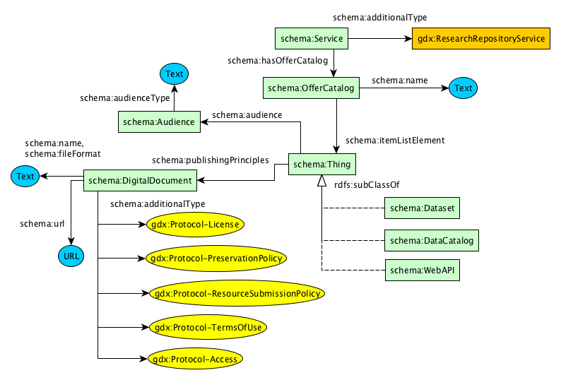](#)

<pre>
{
  "@context": {
    "@vocab": "http://schema.org/",
    "gdx": "https://geodex.org/voc/",
    "datacite": "http://purl.org/spar/datacite/"
  },
  "@type": ["Service", "Organization"],
 "additionalType": "https://geodex.org/voc/ResearchRepositoryService",
  "legalName": "Sample Data Repository Office",
  "name": "SDRO",
  "url": "https://www.sample-data-repository.org",
  ...
  <strong>"hasOfferCatalog": {
    "@type": "OfferCatalog",
    "name": "Sample Data Repository Resource Catalog",
    "itemListElement": [
      {
       "@type": "DataCatalog",
        "@id": "https://www.sample-data-repository.org/collection/biological-data",
        "name": "Biological Data",
        "audience": {
          "@type": "Audience",
          "audienceType": "public",
          "name": "General Public"
        }
      },
      {
        "@type": "DataCatalog",
        "@id": "https://www.sample-data-repository.org/collection/geological-data",
        "name": "Geological Data",
        "audience": {
          "@type": "Audience",
          "audienceType": "public",
          "name": "General Public"
        }
      }
    ]
  }</strong>
}
</pre>

Back to [top](#top)

### Describing a Dataset

The [schema:Dataset](https://schema.org/Dataset) is a very expressive type within schema.org.

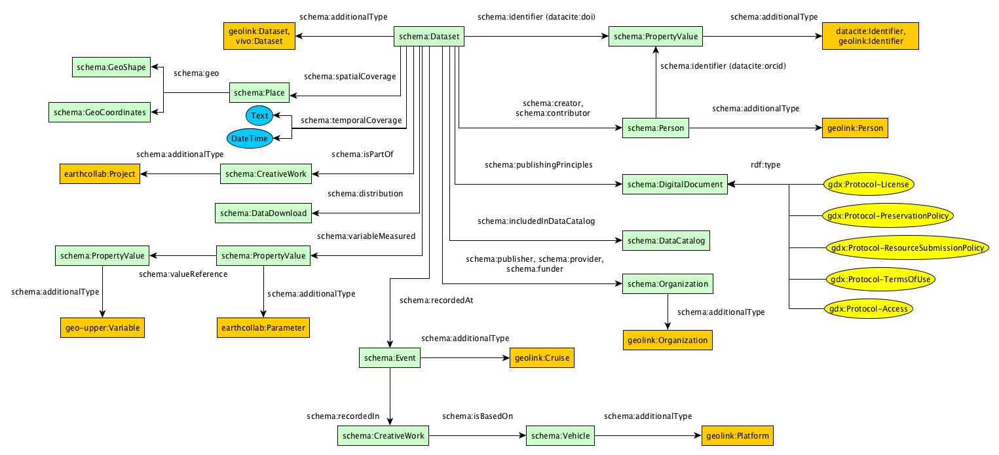

However, Google has drafted a [guide to help publishers](https://developers.google.com/search/docs/data-types/dataset). THe guide describes the only required fields as - name and description.
* [name](https://schema.org/name) - A descriptive name of a dataset (e.g., “Snow depth in Northern Hemisphere”)
* [description](https://schema.org/description) - A short summary describing a dataset.

<pre>
{
  "@context": {
    "@vocab": "http://schema.org/",
    "geolink": "http://schema.geolink.org/1.0/base/main#"
  },
  "@type": "Dataset",
  "additionalType": ["http://schema.geolink.org/1.0/base/main#Dataset", "http://vivoweb.org/ontology/core#Dataset"],
  <strong>"name": "Removal of organic carbon by natural bacterioplankton communities as a function of pCO2 from laboratory experiments between 2012 and 2016",
  "description": "This dataset includes results of laboratory experiments which measured dissolved organic carbon (DOC) usage by natural bacteria in seawater at different pCO2 levels. Included in this dataset are; bacterial abundance, total organic carbon (TOC), what DOC was added to the experiment, target pCO2 level. "</strong>
}
</pre>

The [guide](https://developers.google.com/search/docs/data-types/dataset) suggests the following recommended fields:

* [url](https://schema.org/url) - Location of a page describing the dataset.
* [sameAs](https://schema.org/sameAs) - Other URLs that can be used to access the dataset page. A link to a page that provides more information about the same dataset, usually in a different repository.
* [version](https://schema.org/version) - The version number or identifier for this dataset (text or numeric).
* [isAccessibleForFree](https://schema.org/isAccessibleForFree) - Boolean (true|false) speficying if the dataset is accessible for free.
* [keywords](https://schema.org/keywords) - Keywords summarizing the dataset.
* [license](https://schema.org/license) - A license under which the dataset is distributed (text or URL).
* [identifier](https://schema.org/identifier) - An identifier for the dataset, such as a DOI. (text,URL, or PropertyValue).
* [variableMeasured](https://schema.org/variableMeasured) - What does the dataset measure? (e.g., temperature, pressure)

<pre>
{
  "@context": {
    "@vocab": "http://schema.org/",
    <strong>"geolink": "http://schema.geolink.org/1.0/base/main#",
    "vivo": "http://vivoweb.org/ontology/core#",
    "datacite": "http://purl.org/spar/datacite/"</strong>
  },
  "@type": "Dataset",
  "additionalType": ["http://schema.geolink.org/1.0/base/main#Dataset", "http://vivoweb.org/ontology/core#Dataset"],
  "name": "Removal of organic carbon by natural bacterioplankton communities as a function of pCO2 from laboratory experiments between 2012 and 2016",
  "description": "This dataset includes results of laboratory experiments which measured dissolved organic carbon (DOC) usage by natural bacteria in seawater at different pCO2 levels. Included in this dataset are; bacterial abundance, total organic carbon (TOC), what DOC was added to the experiment, target pCO2 level. ",
  <strong>"url": "https://www.sample-data-repository.org/dataset/472032",
  "sameAs": "https://search.dataone.org/#view/https://www.sample-data-repository.org/dataset/472032",
  "version": "2013-11-21",
  "isAccessibleForFree": true,
  "keywords": "ocean acidification, Dissolved Organic Carbon, bacterioplankton respiration, pCO2, carbon dioxide, oceans",
  "license": "http://creativecommons.org/licenses/by/4.0/"</strong>
}
</pre>

Back to [top](#top)

Adding the [schema:identifier](https://schema.org/identifier) field can be done in three ways - a text description, a URL, or by using the [schema:PropertyValue](https://schema.org/PropertyValue) type to describe the identifier in more detail. We highly recommend using the [schema:PropertyValue](https://schema.org/PropertyValue) as the use of text or url does not get indexed properly by Google and other JSON-LD testing tools due to an issue with the properties definition.

#### Describing a Dataset Identifier
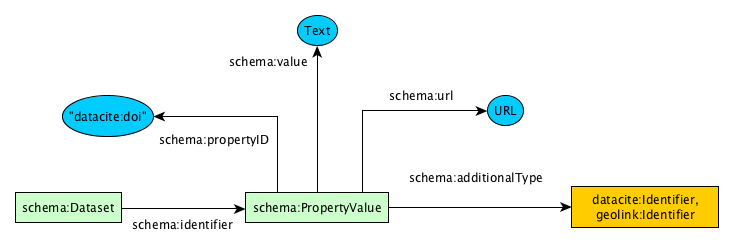

In it's most basic form, the identifier as a [schema:PropertyValue](https://schema.org/PropertyValue) can be published as:

<pre>
{
  "@context": {
    "@vocab": "http://schema.org/",
    "geolink": "http://schema.geolink.org/1.0/base/main#",
    "vivo": "http://vivoweb.org/ontology/core#"
  },
  "@type": "Dataset",
  "additionalType": ["http://schema.geolink.org/1.0/base/main#Dataset", "http://vivoweb.org/ontology/core#Dataset"],
  "name": "Removal of organic carbon by natural bacterioplankton communities as a function of pCO2 from laboratory experiments between 2012 and 2016",
  "description": "This dataset includes results of laboratory experiments which measured dissolved organic carbon (DOC) usage by natural bacteria in seawater at different pCO2 levels. Included in this dataset are; bacterial abundance, total organic carbon (TOC), what DOC was added to the experiment, target pCO2 level. ",
  "url": "https://www.sample-data-repository.org/dataset/472032",
  "sameAs": "https://search.dataone.org/#view/https://www.sample-data-repository.org/dataset/472032",
  "version": "2013-11-21",
  "keywords": "ocean acidification, Dissolved Organic Carbon, bacterioplankton respiration, pCO2, carbon dioxide, oceans",
  "license": "http://creativecommons.org/licenses/by/4.0/",
  <strong>"identifier": "urn:sdro:dataset:472032"</strong>
}
</pre>

The Persistent Identifier, such as a DOI, ARK, URL, etc as a [schema:PropertyValue](https://schema.org/PropertyValue) can be published using the [DataCite Ontology Resource Identifier Scheme](https://sparontologies.github.io/datacite/current/datacite.html#d4e638) to define the identifier as:

<pre>
{
  "@context": {
    "@vocab": "http://schema.org/",
    "geolink": "http://schema.geolink.org/1.0/base/main#",
    "vivo": "http://vivoweb.org/ontology/core#",
    <strong>"datacite": "http://purl.org/spar/datacite/"</strong>
  },
  "@type": "Dataset",
  "additionalType": ["http://schema.geolink.org/1.0/base/main#Dataset", "http://vivoweb.org/ontology/core#Dataset"],
  "name": "Removal of organic carbon by natural bacterioplankton communities as a function of pCO2 from laboratory experiments between 2012 and 2016",
  "description": "This dataset includes results of laboratory experiments which measured dissolved organic carbon (DOC) usage by natural bacteria in seawater at different pCO2 levels. Included in this dataset are; bacterial abundance, total organic carbon (TOC), what DOC was added to the experiment, target pCO2 level. ",
  "url": "https://www.sample-data-repository.org/dataset/472032",
  "sameAs": "https://search.dataone.org/#view/https://www.sample-data-repository.org/dataset/472032",
  "version": "2013-11-21",
  "keywords": "ocean acidification, Dissolved Organic Carbon, bacterioplankton respiration, pCO2, carbon dioxide, oceans",
  "license": "http://creativecommons.org/licenses/by/4.0/",
  <strong>"identifier": {
    "@type": "PropertyValue",
    "additionalType": ["http://schema.geolink.org/1.0/base/main#Identifier", "http://purl.org/spar/datacite/Identifier"],
    "propertyID": "http://purl.org/spar/datacite/doi",
    "url": "https://doi.org/10.1575/1912/bco-dmo.665253",
    "value": "10.1575/1912/bco-dmo.665253"
  }</strong>
}
</pre>

[schema:Dataset](https://schema.org/Dataset) also defines a field for the [schema:citation](https://schema.org/citation) as either text or a [schema:CreativeWork](https://schema.org/CreativeWork). To provide citation text:

NOTE: If you have a DOI, the citation text can be [automatically generated](https://citation.crosscite.org/docs.html#sec-4-1) for you by querying a DOI URL with the Accept Header of 'text/x-bibliography'.

<pre>
{
  "@context": {
    "@vocab": "http://schema.org/",
    "geolink": "http://schema.geolink.org/1.0/base/main#",
    "vivo": "http://vivoweb.org/ontology/core#",
    <strong>"datacite": "http://purl.org/spar/datacite/"</strong>
  },
  "@type": "Dataset",
  "additionalType": ["http://schema.geolink.org/1.0/base/main#Dataset", "http://vivoweb.org/ontology/core#Dataset"],
  "name": "Removal of organic carbon by natural bacterioplankton communities as a function of pCO2 from laboratory experiments between 2012 and 2016",
  "description": "This dataset includes results of laboratory experiments which measured dissolved organic carbon (DOC) usage by natural bacteria in seawater at different pCO2 levels. Included in this dataset are; bacterial abundance, total organic carbon (TOC), what DOC was added to the experiment, target pCO2 level. ",
  "url": "https://www.sample-data-repository.org/dataset/472032",
  "sameAs": "https://search.dataone.org/#view/https://www.sample-data-repository.org/dataset/472032",
  "version": "2013-11-21",
  "keywords": "ocean acidification, Dissolved Organic Carbon, bacterioplankton respiration, pCO2, carbon dioxide, oceans",
  "license": "http://creativecommons.org/licenses/by/4.0/",
  "identifier": {
    "@id": "https://doi.org/10.1575/1912/bco-dmo.665253",
    "@type": "PropertyValue",
    "additionalType": ["http://schema.geolink.org/1.0/base/main#Identifier", "http://purl.org/spar/datacite/Identifier"],
    "propertyID": "http://purl.org/spar/datacite/doi",
    "url": "https://doi.org/10.1575/1912/bco-dmo.665253",
    "value": "10.1575/1912/bco-dmo.665253"
   },
   <strong>"citation": "J.Smith 'How I created an awesome dataset’, Journal of Data Science, 1966"</strong>
}
</pre>

Back to [top](#top)

Adding the [schema:variableMeasured](https://schema.org/variableMeasured) field can be done in two ways - a text description of each variable or by using the [schema:PropertyValue](https://schema.org/PropertyValue) type to describe the variable in more detail. We highly recommend using the [schema:PropertyValue](https://schema.org/PropertyValue).

#### Describing a Dataset's Variables

In it's most basic form, the variable as a [schema:PropertyValue](https://schema.org/PropertyValue) can be published as:

<pre>
{
  "@context": {
    "@vocab": "http://schema.org/",
    "geolink": "http://schema.geolink.org/1.0/base/main#",
    "vivo": "http://vivoweb.org/ontology/core#",
    <strong>"earthcollab": "https://library.ucar.edu/earthcollab/schema#"</strong>
  },
  "@type": "Dataset",
  "additionalType": ["http://schema.geolink.org/1.0/base/main#Dataset", "http://vivoweb.org/ontology/core#Dataset"],
  "name": "Removal of organic carbon by natural bacterioplankton communities as a function of pCO2 from laboratory experiments between 2012 and 2016",
  ...
  <strong>"variableMeasured": [
    {
      "@type": "PropertyValue",
      "additionalType": "https://library.ucar.edu/earthcollab/schema#Parameter",
      "name": "Bottle identifier",
      "description": "The bottle number for each associated measurement."
    },
    ...
  ]</strong>
}
</pre>

A fully-fleshed out example that uses a vocabulary to describe the variable can be published as:

<pre>
{
  "@context": {
    "@vocab": "http://schema.org/",
    "geolink": "http://schema.geolink.org/1.0/base/main#",
    "vivo": "http://vivoweb.org/ontology/core#",
    <strong>"gsn-quantity": "http://www.geoscienceontology.org/geo-lower/quantity#"</strong>
  },
  "@type": "Dataset",
  "additionalType": ["http://schema.geolink.org/1.0/base/main#Dataset", "http://vivoweb.org/ontology/core#Dataset"],
  "name": "Removal of organic carbon by natural bacterioplankton communities as a function of pCO2 from laboratory experiments between 2012 and 2016",
  ...
  "variableMeasured": [
    {
      "@type": "PropertyValue",
      <strong>"additionalType": "http://www.geoscienceontology.org/geo-lower/quantity#latitude",</strong>
      "name": "latitude",
      "url": "https://www.sample-data-repository.org/dataset-parameter/665787",
      "description": "Latitude where water samples were collected; north is positive.",
      "unitText": "decimal degrees",
      "minValue": "45.0",
      "maxValue": "15.0"
    },
    ...
  ]
}
</pre>

Back to [top](#top)

#### Describing a Dataset's Catalog

For some repositories, defining a one or many data collections helps contextualize the datasets. In schema.org, you define these collections using [schema:DataCatalog](https://schema.org/DataCatalog).

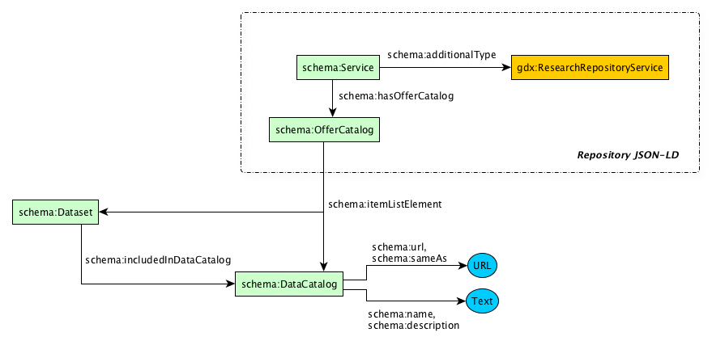

The most optimal way to use these DataCatalogs for a repository is to define these catalogs as an ["offering" of your repository[(#repository-offercatalog) and including the `@id` property to be reused in the dataset JSON-LD. For example, the repository JSON-LD defines a [schema:DataCatalog](https://schema.org/DataCatalog) with the

`"@id": "https://www.sample-data-repository.org/collection/biological-data"`.

In the dataset JSON-LD, we reuse that `@id` to say a dataset belongs in that catalog:

<pre>
{
  "@context": {
    "@vocab": "http://schema.org/",
    "geolink": "http://schema.geolink.org/1.0/base/main#",
    "vivo": "http://vivoweb.org/ontology/core#",
    earthcollab": "https://library.ucar.edu/earthcollab/schema#",
    "geo-upper": "http://www.geoscienceontology.org/geo-upper#"
  },
  "@type": "Dataset",
  "additionalType": ["http://schema.geolink.org/1.0/base/main#Dataset", "http://vivoweb.org/ontology/core#Dataset"],
  "name": "Removal of organic carbon by natural bacterioplankton communities as a function of pCO2 from laboratory experiments between 2012 and 2016",
  ...
  <strong>"includedInDataCatalog": {
    "@id": "https://www.sample-data-repository.org/collection/biological-data"
  }</strong>
}
</pre>

Back to [top](#top)

#### Describing a Dataset's Distributions

Where the [schema:url](https://schema.org/url) property of the Dataset should point to a landing page, the way to describe how to download the data in a specific format is through the [schema:distribution](https://schema.org/distribution) property. The "distribution" property describes where to get the data and in what format by using the [schema:DataDownload](https://schema.org/DataDownload) type. If your dataset is not accessible through a direct download URL, but rather through a service URL that may need input parameters jump to the next section [Accessing Data through a Service Endpoint](#dataset-service-endpoint).

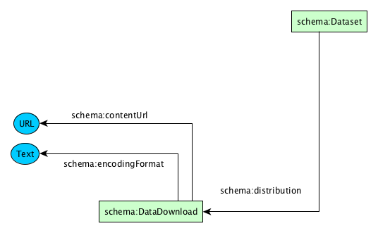

For data available in multipe formats, there will be multiple values of the [schema:DataDownload](https://schema.org/DataDownload):

<pre>
{
  "@context": {
    "@vocab": "http://schema.org/",
    "geolink": "http://schema.geolink.org/1.0/base/main#",
    "vivo": "http://vivoweb.org/ontology/core#",
    earthcollab": "https://library.ucar.edu/earthcollab/schema#",
    "geo-upper": "http://www.geoscienceontology.org/geo-upper#"
  },
  "@type": "Dataset",
  "additionalType": ["http://schema.geolink.org/1.0/base/main#Dataset", "http://vivoweb.org/ontology/core#Dataset"],
  "name": "Removal of organic carbon by natural bacterioplankton communities as a function of pCO2 from laboratory experiments between 2012 and 2016",
  ...
  <strong>"distribution": {
    "@type": "DataDownload",
    "contentUrl": "https://www.sample-data-repository.org/dataset/472032.tsv",
    "encodingFormat": "text/tab-separated-values"
  }</strong>
}
</pre>

##### Accessing Data through a Service Endpoint

If access to the data requires some input parameters before a download can occur, we can use the [schema:potentialAction](https://schema.org/potentialAction) in this way:

<pre>
{
  "@context": {
    "@vocab": "http://schema.org/",
    "geolink": "http://schema.geolink.org/1.0/base/main#",
    "vivo": "http://vivoweb.org/ontology/core#",
    earthcollab": "https://library.ucar.edu/earthcollab/schema#",
    "geo-upper": "http://www.geoscienceontology.org/geo-upper#"
  },
  "@type": "Dataset",
  "additionalType": ["http://schema.geolink.org/1.0/base/main#Dataset", "http://vivoweb.org/ontology/core#Dataset"],
  "name": "Removal of organic carbon by natural bacterioplankton communities as a function of pCO2 from laboratory experiments between 2012 and 2016",
  ...
  <strong>"potentialAction": {
    "@type": "SearchAction",
    "target": {
        "@type": "EntryPoint",
        "contentType": ["application/x-netcdf", "text/tab-separated-values"],
        "urlTemplate": "https://www.sample-data-repository.org/dataset/1234/download?format={format}&startDateTime={start}&endDateTime={end}&bounds={bbox}",
        "description": "Download dataset 1234 based on the requested format, start/end dates and bounding box",
        "httpMethod": ["GET", "POST"]
    },
    "query-input": [
      {
        "@type": "PropertyValueSpecification",
        "valueName": "format",
        "description": "The desired format requested either 'application/x-netcdf' or 'text/tab-separated-values'",
        "valueRequired": true,
        "defaultValue": "application/x-netcdf",
        "valuePattern": "(application\/x-netcdf|text\/tab-separated-values)"
      },
      {
        "@type": "PropertyValueSpecification",
        "valueName": "start",
        "description": "A UTC ISO DateTime",
        "valueRequired": false,
        "valuePattern": "(-?(?:[1-9][0-9]*)?[0-9]{4})-(1[0-2]|0[1-9])-(3[01]|0[1-9]|[12][0-9])T(2[0-3]|[01][0-9]):([0-5][0-9]):([0-5][0-9])(.[0-9]+)?(Z)?"
      },
      {
        "@type": "PropertyValueSpecification",
        "valueName": "end",
        "description": "A UTC ISO DateTime",
        "valueRequired": false,
        "valuePattern": "(-?(?:[1-9][0-9]*)?[0-9]{4})-(1[0-2]|0[1-9])-(3[01]|0[1-9]|[12][0-9])T(2[0-3]|[01][0-9]):([0-5][0-9]):([0-5][0-9])(.[0-9]+)?(Z)?"
      },
      {
        "@type": "PropertyValueSpecification",
        "valueName": "bbox",
        "description": "Two points in decimal degrees that create a bounding box fomatted at 'lon,lat' of the lower-left corner and 'lon,lat' of the upper-right",
        "valueRequired": false,
        "valuePattern": "(-?[0-9]+(.[0-9]+)?),[ ]*(-?[0-9]+(.[0-9]+)?)[ ]*(-?[0-9]+(.[0-9]+)?),[ ]*(-?[0-9]+(.[0-9]+)?)"
      }
    ]
  }</strong>
}
</pre>

Here, we use the [schema:SearchAction](https://schema.org/SearchAction) type becuase it lets you define the query parameters and HTTP methods so that machines can build user interfaces to collect those query parmaeters and actuate a request to provide the user what they are looking for.

Back to [top](#top)

#### Describing a Dataset's Temporal Coverage

Temporal coverage is a difficult concept to cover across all the possible scenarios. Schema.org uses [ISO 8601 standard](https://en.wikipedia.org/wiki/ISO_8601) to describe time intervals and time points, but doesn't provide capabilities for geologic time scales or dynamically generated data up to present time. We ask for your [feedback on any temporal coverages you may have that don't currently fit into schema.org](https://github.com/earthcubearchitecture-project418/p418Vocabulary/issues). You can follow [similar issues at the schema.org Github issue] queue(https://github.com/schemaorg/schemaorg/issues/242)

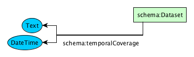

To represent a single date and time:
<pre>
{
  "@context": {
    "@vocab": "http://schema.org/",
    "geolink": "http://schema.geolink.org/1.0/base/main#",
    "vivo": "http://vivoweb.org/ontology/core#",
    earthcollab": "https://library.ucar.edu/earthcollab/schema#",
    "geo-upper": "http://www.geoscienceontology.org/geo-upper#"
  },
  "@type": "Dataset",
  "additionalType": ["http://schema.geolink.org/1.0/base/main#Dataset", "http://vivoweb.org/ontology/core#Dataset"],
  "name": "Removal of organic carbon by natural bacterioplankton communities as a function of pCO2 from laboratory experiments between 2012 and 2016",
  ...
  <strong>"temporalCoverage": "2018-01-22T14:51:12+00:00"</strong>
}
</pre>

Or a single date:
<pre>
{
  ...
  <strong>"temporalCoverage": "2018-01-22"</strong>
}
</pre>

Or a date range:
<pre>
{
  ...
  <strong>"temporalCoverage": "2012-09-20/2016-01-22"</strong>
}
</pre>

Schema.org also lets you provide date ranges and other temporal coverages through the [DateTime](http://schema.org/DateTime) data type. For more granular temporal coverages go here: [http://schema.org/DateTime](http://schema.org/DateTime).

Back to [top](#top)

#### Describing a Dataset's Spatial Coverage

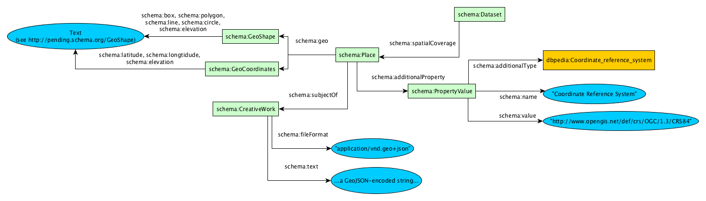

The types of spatial coverages in schema.org are

* [point](https://schema.org/GeoCoordinates) - specify the [schema:latitude](https://schema.org/latitude) and [schema:longitude](https://schema.org/longitude) properties of the schema:GeoCoordinates]() type.

The following shapes use the [schema:GeoShape](https://schema.org/GeoShape) type where a 'point' is defined as a latitude/longitude pair separated by a comma.

* [line](https://schema.org/line) - a series of two or more point objects separated by space.
* [polygon](https://schema.org/polygon) - a series of four or more space delimited points where the first and final points are identical.
* [box](https://schema.org/polboxygon) - two points separated by a space character where the first point is the lower corner and the second point is the upper corner.

These spatial definitiosn were added to schema.org very early on in its [development](https://github.com/schemaorg/schemaorg/issues/8#issuecomment-97667478) where they decided to follow the [GeoRSS specification](http://www.georss.org/simple). While this is not ideal, there are ongoing conversations about improving this in schema.org.

A point, or coordinate, would defined in this way:

<pre>
{
  "@context": {
    "@vocab": "http://schema.org/",
    "geolink": "http://schema.geolink.org/1.0/base/main#",
    "vivo": "http://vivoweb.org/ontology/core#",
    earthcollab": "https://library.ucar.edu/earthcollab/schema#",
    "geo-upper": "http://www.geoscienceontology.org/geo-upper#"
  },
  "@type": "Dataset",
  "additionalType": ["http://schema.geolink.org/1.0/base/main#Dataset", "http://vivoweb.org/ontology/core#Dataset"],
  "name": "Removal of organic carbon by natural bacterioplankton communities as a function of pCO2 from laboratory experiments between 2012 and 2016",
  ...
  <strong>"spatialCoverage": {
    "@type": "Place",
    "geo": {
      "@type": "GeoCoordinates",
      "latitude": 39.3280
      "longitude": 120.1633
    }
  }</strong>
}
</pre>

All other shapes, are defined using the [schema:GeoShape](https://schema.org/GeoShape):

<pre>
  <strong>"spatialCoverage": {
    "@type": "Place",
    "geo": {
      "@type": "GeoShape",
      "line": "39.3280,120.1633 40.445,123.7878"
    }
  }</strong>
}
</pre>

A polygon
<pre>
  <strong>"polygon": "39.3280 120.1633 40.445 123.7878 41 121 39.77 122.42 39.3280 120.1633"</strong>
</pre>

A box where 'lower-left' corner is 39.3280/120.1633 and 'upper-right' corner is 40.445/123.7878
<pre>
  <strong>"box": "39.3280 120.1633 40.445 123.7878"</strong>
</pre>

For Project418, we feel the defined spatial coverages are inadequate for the needs of our community, but we also recognize that schema.org continues to hear the needs of its schema.org publishers on these [issues](https://github.com/schemaorg/schemaorg/issues/1548).

To alleviate some of the pain of converting spatial information into these defined shapes, Project418 offers support for GeoJSON by using the [schema:subjectOf](https://schema.org/subjectOf) property of the [schema:Place](https://schema.org/Place) type. The [schema:fileFormat](https://schema.org/fileFormat) property should have the value of the GeoJSON mime type `application\/vnd.geo+json` and the [schema:text](https://schema.org/text) property should be the encoded value of the GeoJSON itself:

<pre>
"spatialCoverage": {
    "@type": "Place",
    <strong>"subjectOf": {
      "@type": "CreativeWork",
      "fileFormat": "application\/vnd.geo+json",
      "text":"{\u0022type\u0022:\u0022Feature\u0022,\u0022geometry\u0022: {\u0022type\u0022:\u0022Polygon\u0022,\u0022coordinates\u0022:[[[-64.6353,34.407],[-149.8727,34.407],[-149.8727,-17.45],[-64.6353,-17.45],[-64.6353,34.407]]],\u0022properties\u0022:[]}}"
    }</strong>
  }
</pre>

We also recognize that there is no defined property for specifying a Coordinate Reference System, but we see from the [schema.org issue queue](https://github.com/schemaorg/schemaorg/issues) that this has been mentioned.

If you have multiple geometries, you can publish those by making the [schema:geo](https://schema.org/geo) field an array of [GeoShape](https://schema.org/GeoShape) or [GeoCoordinates](https://schema.org/GeoCoordinates) like so:

<pre>
{
  ...
  "spatialCoverage": {
    "@type": "Place",
    <strong>"geo": [</strong>
      {
        "@type": "GeoCoordinates",
        "latitude": -17.65,
        "longitude": 50
      },
      {
        "@type": "GeoCoordinates",
        "latitude": -19,
        "longitude": 51
      },
      ...
    <strong>]</strong>
  }
  ...
}
</pre>

Back to [top](#top)

#### Describing a Dataset's Creators/Contributors

People can be linked to datasets iusing three fields: author, creator, and contributor. Since  [schema:contributor](https://schema.org/contributor) is defined as a secondary author, and [schema:Creator](https://schema.org/creator) is defined as being synonymous with the [schema:author](https://schema.org/author) field, we recommend using the more expressive fields of creator and contribulds of creator and contributor. But using any of these fields are okay. Becuase there are more things that can be said about how and when a person contributed to a Dataset, we use the [schema:Role](https://schema.org/Role). You'll notice that the schema.org documentation does not state that the Role type is an expected data type of author, creator and contributor, but that is addressed in this [blog post introducing Role into schema.org](http://blog.schema.org/2014/06/introducing-role.html). *Thanks to [Stephen Richard](https://github.com/smrgeoinfo) for this contribution*

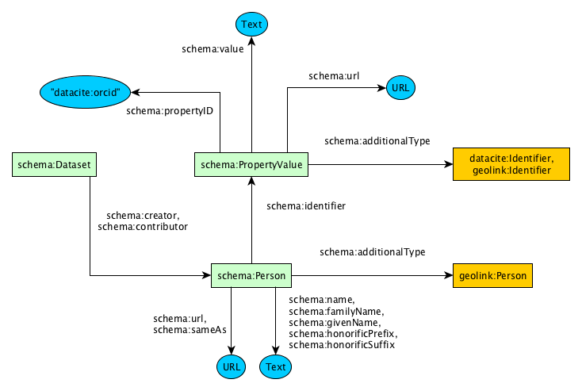

<pre>
{
  "@context": {
    "@vocab": "http://schema.org/",
    "geolink": "http://schema.geolink.org/1.0/base/main#",
    "vivo": "http://vivoweb.org/ontology/core#",
    earthcollab": "https://library.ucar.edu/earthcollab/schema#",
    "geo-upper": "http://www.geoscienceontology.org/geo-upper#"
  },
  "@type": "Dataset",
  "additionalType": ["http://schema.geolink.org/1.0/base/main#Dataset", "http://vivoweb.org/ontology/core#Dataset"],
  "name": "Removal of organic carbon by natural bacterioplankton communities as a function of pCO2 from laboratory experiments between 2012 and 2016",
  ...
  <strong>"creator": [
    {
      "@id": "http://lod.bco-dmo.org/id/person-role/472036",
      "@type": "Role",
      "additionalType": "http://schema.geolink.org/1.0/base/main#Participant",
      "roleName": "Principal Investigator",
      "url": "http://lod.bco-dmo.org/id/person-role/472036",
      "creator": {
        "@id": "https://www.bco-dmo.org/person/51317",
        "@type": "Person",
        "additionalType": "http://schema.geolink.org/1.0/base/main#Person",
        "name": "Dr Uta Passow",
        "givenName": "Uta",
        "familyName": "Passow",
        "url": "https://www.bco-dmo.org/person/51317"
      }
    },
    {
      "@id": "http://lod.bco-dmo.org/id/person-role/472038",
      "@type": "Role",
      "additionalType": "http://schema.geolink.org/1.0/base/main#Participant",
      "roleName": "Co-Principal Investigator",
      "url": "https://www.bco-dmo.org/person-role/472038",
      "creator": {
        "@id": "https://www.bco-dmo.org/person/50663",
        "@type": "Person",
        "additionalType": "http://schema.geolink.org/1.0/base/main#Person",
        "identifier": {
          "@type": "PropertyValue",
          "additionalType": ["http://schema.geolink.org/1.0/base/main#Identifier", "http://purl.org/spar/datacite/Identifier"],
          "propertyID": "http://purl.org/spar/datacite/orcid",
          "url": "https://orcid.org/0000-0003-3432-2297",
          "value": "0000-0003-3432-2297"
        },
        "name": "Dr Mark Brzezinski",
        "url": "https://www.bco-dmo.org/person/50663"
      }
    }</strong>
}
</pre>
NOTE that the Role inherits the property `creator` and `contributor` from the Dataset when pointing to the [schema:Person](https://schema.org/Person).

<pre>
{
  "@context": {
    "@vocab": "http://schema.org/",
    ...
  },
  <strong>"@type": "Dataset"</strong>,
  ...
  <strong>"creator"</strong>: [
    {
      "@id": "http://lod.bco-dmo.org/id/person-role/472036",
      <strong>"@type": "Role"</strong>,
      "additionalType": "http://schema.geolink.org/1.0/base/main#Participant",
      "roleName": "Principal Investigator",
      "url": "http://lod.bco-dmo.org/id/person-role/472036",
      <strong>"creator":</strong> {
        "@id": "https://www.bco-dmo.org/person/51317",
        "@type": "Person",
        "additionalType": "http://schema.geolink.org/1.0/base/main#Person",
        "name": "Dr Uta Passow",
        "givenName": "Uta",
        "familyName": "Passow",
        "url": "https://www.bco-dmo.org/person/51317"
      }
    }
}
</pre>

If a single Person plays multiple roles on a Dataset, each role should be explicitly defined in this way:

<pre>
{
  "@context": {
    "@vocab": "http://schema.org/",
    "geolink": "http://schema.geolink.org/1.0/base/main#",
    "vivo": "http://vivoweb.org/ontology/core#",
    earthcollab": "https://library.ucar.edu/earthcollab/schema#",
    "geo-upper": "http://www.geoscienceontology.org/geo-upper#"
  },
  "@type": "Dataset",
  "additionalType": ["http://schema.geolink.org/1.0/base/main#Dataset", "http://vivoweb.org/ontology/core#Dataset"],
  "name": "Removal of organic carbon by natural bacterioplankton communities as a function of pCO2 from laboratory experiments between 2012 and 2016",
  ...
  "creator": [
    {
      "@id": "http://lod.bco-dmo.org/id/person-role/472036",
      "@type": "Role",
      "additionalType": "http://schema.geolink.org/1.0/base/main#Participant",
      "roleName": "Principal Investigator",
      "url": "http://lod.bco-dmo.org/id/person-role/472036",
      "creator": {
        <strong>"@id": "https://www.bco-dmo.org/person/51317"</strong>,
        "@type": "Person",
        "additionalType": "http://schema.geolink.org/1.0/base/main#Person",
        "name": "Dr Uta Passow",
        "givenName": "Uta",
        "familyName": "Passow",
        "url": "https://www.bco-dmo.org/person/51317"
      }
    },
    <strong>{
      "@id": "https://www.bco-dmo.org/person-role/472037",
      "@type": "Role",
      "additionalType": "http://schema.geolink.org/1.0/base/main#Participant",
      "roleName": "Contact",
      "url": "https://www.bco-dmo.org/person-role/472037",
      "creator": { "@id": "https://www.bco-dmo.org/person/51317" }
    }</strong>,
    {
      "@id": "http://lod.bco-dmo.org/id/person-role/472038",
      "@type": "Role",
      "additionalType": "http://schema.geolink.org/1.0/base/main#Participant",
      "roleName": "Co-Principal Investigator",
      "url": "https://www.bco-dmo.org/person-role/472038",
      "creator": {
        "@id": "https://www.bco-dmo.org/person/50663",
        "@type": "Person",
        "additionalType": "http://schema.geolink.org/1.0/base/main#Person",
        "identifier": {
          "@type": "PropertyValue",
          "additionalType": ["http://schema.geolink.org/1.0/base/main#Identifier", "http://purl.org/spar/datacite/Identifier"],
          "propertyID": "http://purl.org/spar/datacite/orcid",
          "url": "https://orcid.org/0000-0003-3432-2297",
          "value": "0000-0003-3432-2297"
        },
        "name": "Dr Mark Brzezinski",
        "url": "https://www.bco-dmo.org/person/50663"
      }
    }
}
</pre>

Notice that since Uta Passow has already been defined in the document with `"@id": "https://www.bco-dmo.org/person/51317"` for her role as Principal Investigator, the `@id` can be used for her role as Contact by defining the Role's creator as `"creator": { "@id": "https://www.bco-dmo.org/person/51317" }`.

Back to [top](#top)

#### Describing a Dataset's Publisher/Provider

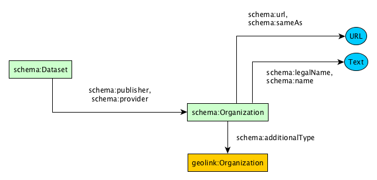

If your repository is the publisher and/or provider of the dataset then you don't have to describe your repository as a [schema:Organziation](https://schema.org/Organization) **if** your repository markup includes the **`@id`**. For example, if you published repository markup such as:
<pre>
{
  "@context": {...},
  "@type": ["Service", "Organization"],
  ...
  <strong>"@id": "https://www.sample-data-repository.org"</strong>
  ...
}
</pre>

then you can reuse that `@id` here. Harvesters such as Google and Project418 will make the appropriate linkages and your dataset publisher/provider can be published in this way:

<pre>
{
  "@context": {
    "@vocab": "http://schema.org/",
    "geolink": "http://schema.geolink.org/1.0/base/main#",
    "vivo": "http://vivoweb.org/ontology/core#",
    earthcollab": "https://library.ucar.edu/earthcollab/schema#",
    "geo-upper": "http://www.geoscienceontology.org/geo-upper#"
  },
  "@type": "Dataset",
  "additionalType": ["http://schema.geolink.org/1.0/base/main#Dataset", "http://vivoweb.org/ontology/core#Dataset"],
  "name": "Removal of organic carbon by natural bacterioplankton communities as a function of pCO2 from laboratory experiments between 2012 and 2016",
  ...
<strong>"provider": {
    "@id": "https://www.sample-data-repository.org"
  },
  "publisher": {
    "@id": "https://www.sample-data-repository.org"
  }</strong>
}
</pre>

Otherwise, you can define the organization inline in this way:

<pre>
{
  "@context": {
    "@vocab": "http://schema.org/",
    "geolink": "http://schema.geolink.org/1.0/base/main#",
    "vivo": "http://vivoweb.org/ontology/core#",
    earthcollab": "https://library.ucar.edu/earthcollab/schema#",
    "geo-upper": "http://www.geoscienceontology.org/geo-upper#"
  },
  "@type": "Dataset",
  "additionalType": ["http://schema.geolink.org/1.0/base/main#Dataset", "http://vivoweb.org/ontology/core#Dataset"],
  "name": "Removal of organic carbon by natural bacterioplankton communities as a function of pCO2 from laboratory experiments between 2012 and 2016",
  ...
<strong>"provider": {
    "@id": "https://www.sample-data-repository.org",
    "@type": "Organization",
    "additionalType": "http://schema.geolink.org/1.0/base/main#Organization",
    "legalName": "Sample Data Repository Office",
    "name": "SDRO",
    "sameAs": "http://www.re3data.org/repository/r3dxxxxxxxxx",
    "url": "https://www.sample-data-repository.org"
  },
  "publisher": {
    "@id": "https://www.sample-data-repository.org"
  }</strong>
}
</pre>

Back to [top](#top)

#### Describing a Dataset's Protocols

Datasets can have a number of policies and protocols attached to them - Terms of Use, access restrictions, certain licenses, etc. If you want to represent one or more of these protocols and there is a URL at which a user can read that protocol, we can use the [schema:DigitalDocument](https://schema.org/DigitalDocument) to describe the protocol using the [schema:publishingPrinciples](https://schema.org/publishingPrinciples) field.

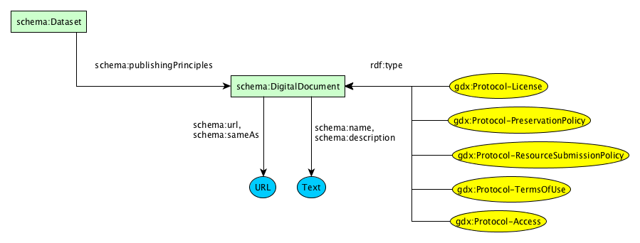

<pre>
{
  "@context": {
    "@vocab": "http://schema.org/",
    "geolink": "http://schema.geolink.org/1.0/base/main#",
    "vivo": "http://vivoweb.org/ontology/core#",
    earthcollab": "https://library.ucar.edu/earthcollab/schema#",
    "geo-upper": "http://www.geoscienceontology.org/geo-upper#"
  },
  "@type": "Dataset",
  "additionalType": ["http://schema.geolink.org/1.0/base/main#Dataset", "http://vivoweb.org/ontology/core#Dataset"],
  "name": "Removal of organic carbon by natural bacterioplankton communities as a function of pCO2 from laboratory experiments between 2012 and 2016",
  ...
<strong>"publishingPrinciples": {
    "@id": "http://creativecommons.org/licenses/by/4.0/",
    "@type": "DigitalDocument",
    "additionalType": "https://geodex.org/voc/Protocol-License",
    "name": "Dataset Usage License",
    "url": "http://creativecommons.org/licenses/by/4.0/"
  }</strong>
}
</pre>

P418 has created some class names for some common protocol document types. These will help make it clear to users what types of policies you have. If you would like us to add more, please let us know by creating an [Issue](https://github.com/earthcubearchitecture-project418/p418Vocabulary/issues/new).

Back to [top](#top)

Trying to describe a Dataset's funding award is one area of schema.org that doesn't fit all that well. There is a lot of [discussion](https://github.com/schemaorg/schemaorg/issues/383) on this topic already happening with schema.org governance.
Schema.org's most recent communication with P418 recommended that the award be something generated from the [schema:funder](https://schema.org/funder). We feel the best class to classify as an Award **until this is addressed by schema.org** is the [schema:Offer](https://schema.org/Offer). If you specify an Award, you **should** also use the `gdx:fundedBy` property to directly link the Dataset to the Award in this way.

#### Describing a Dataset's Funding
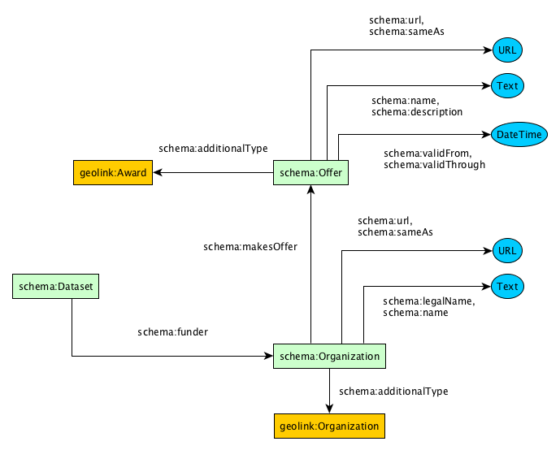

* [schema:name]() - The award title
* [schema:description]() - The award description/abstract
* [schema:identifier]() - The award identifier,number,etc.
* [schema:validFrom]() - The award start date
* [schema:validThrough]() - The award end date

<pre>
{
  "@context": {
    "@vocab": "http://schema.org/",
    "geolink": "http://schema.geolink.org/1.0/base/main#",
    "vivo": "http://vivoweb.org/ontology/core#",
    earthcollab": "https://library.ucar.edu/earthcollab/schema#",
    "geo-upper": "http://www.geoscienceontology.org/geo-upper#",
    "geolink-vocab": "http://schema.geolink.org/1.0/voc/local#"
  },
  "@type": "Dataset",
  "additionalType": ["http://schema.geolink.org/1.0/base/main#Dataset", "http://vivoweb.org/ontology/core#Dataset"],
  "name": "Removal of organic carbon by natural bacterioplankton communities as a function of pCO2 from laboratory experiments between 2012 and 2016",
  ...
<strong>"funder": {
    "@type": "Organization",
    "additionalType": "http://schema.geolink.org/1.0/base/main#Organization",
    "legalName": "National Science Foundation",
    "name": "NSF",
    "url": "https://www.nsf.gov",
    "identifier": {
      "@type": "PropertyValue",
      "propertyID": "http://purl.org/spar/datacite/doi",
      "value": "10.13039/100000141",
      "url": "https://doi.org/10.13039/100000001"
    },
    "makesOffer": {
      "@type": "Offer",
      "@id": "https://www.nsf.gov/awardsearch/showAward?AWD_ID=1623751",
      "additionalType": "http://schema.geolink.org/1.0/base/main#Award",
      "name": "EarthCube Science Support Office (ESSO)",
      "description": "EarthCube is a community-driven effort with the goal of transforming the conduct of geoscience research and education by creating a well-integrated and facile environment to share scientific data, information tools and services, and knowledge in an open, transparent, and inclusive manner....[truncated]",
      "identifier": {
        "@type": "PropertyValue",
        "name": "NSF Award Number",
        "value": "1623751",
        "url": "https://www.nsf.gov/awardsearch/showAward?AWD_ID=1623751"
      },
      "validFrom": "2016-05-01",
      "validThrough": "2019-04-30",
      "offeredBy": {
        "@type": "Person",
        "additionalType": "http://schema.geolink.org/1.0/voc/local#roletype_program_manager",
        "name": "Eva E. Zanzerkia"
      }
    },
    "parentOrganization": {
      "@type": "Organization",
      "legalName": "Directorate for Geosciences",
      "identifier": {
        "@type": "PropertyValue",
        "propertyID": "http://purl.org/spar/datacite/doi",
        "value": "10.13039/100000085",
        "url": "https://doi.org/10.13039/100000085"
       },
      "parentOrganization": {
        "@type": "Organization",
        "legalName": "National Science Foundation",
        "url": "http://www.nsf.gov",
        "identifier": {
          "@type": "PropertyValue",
          "propertyID": "http://purl.org/spar/datacite/doi",
          "value": "10.13039/100000001",
          "url": "https://doi.org/10.13039/100000001"
        }
      }
    }
  },
  "gdx:fundedBy": { "@id": "https://www.nsf.gov/awardsearch/showAward?AWD_ID=1623751" }</strong>
 }
</pre>

Back to [top](#top)

### Examples

All examples can be found at: https://github.com/earthcubearchitecture-project418/p418Vocabulary/tree/master/html/voc/static/schema/examples/

* [Repository Examples](https://github.com/earthcubearchitecture-project418/p418Vocabulary/tree/master/html/voc/static/schema/examples/repository)
  * [Full Example by BCO-DMO](https://github.com/earthcubearchitecture-project418/p418Vocabulary/blob/master/html/voc/static/schema/examples/repository/full.jsonld)
  * [Minimal Example by BCO-DMO](https://github.com/earthcubearchitecture-project418/p418Vocabulary/blob/master/html/voc/static/schema/examples/repository/minimal.jsonld)
  * See [BCO-DMO homepage](https://www.bco-dmo.org) (view source of the page to see the schema.org JSON-LD)
* [Dataset Examples](https://github.com/earthcubearchitecture-project418/p418Vocabulary/tree/master/html/voc/static/schema/examples/resource)
  * [Full Example by BCO-DMO](https://github.com/earthcubearchitecture-project418/p418Vocabulary/blob/master/html/voc/static/schema/examples/resource/dataset-full.jsonld)
  * [Minimal Example by BCO-DMO](https://github.com/earthcubearchitecture-project418/p418Vocabulary/blob/master/html/voc/static/schema/examples/resource/dataset-minimal.jsonld)

Back to [top](#top)

#### Issues

https://stackoverflow.com/questions/38243521/schema-org-contacttype-validation-issue-the-value-provided-for-office-must-be

Back to [top](#top)

### Advanced Publishing Techniques

#### How to publish resources for the categories/disciplines at repository services.
#### & How to use external vocabularies

The SWEET ontology defines a number of science disciplines and a repository could reference those, or another vocabuary's resources, by adding the vocabular to the `@context` attribute of the JSON-LD markup.

<pre>
{
  "@context": {
    "@vocab": "http://schema.org/",
    "gdx": "https://geodex.org/voc/",
    <strong>"sweet-rel": "http://sweetontology.net/rela/",
    "sweet-kd": "http://sweetontology.net/humanKnowledgeDomain/"</strong>
  },
  "@type": ["Service", "Organization"],
  "additionalType": "https://geodex.org/voc/ResearchRepositoryService",
  "legalName": "Sample Data Repository Office",
  "name": "SDRO",
  "url": "https://www.sample-data-repository.org",
  "description": "The Sample Data Repository Service provides access to data from an imaginary domain accessible from this website.",
  <strong>"sweet-rel:hasRealm": [
    { "@id": "sweet-kd:Biogeochemistry" },
    { "@id": "sweet-kd:Oceanography" }
  ]
  </strong>
}
</pre>

Back to [top](#top)
