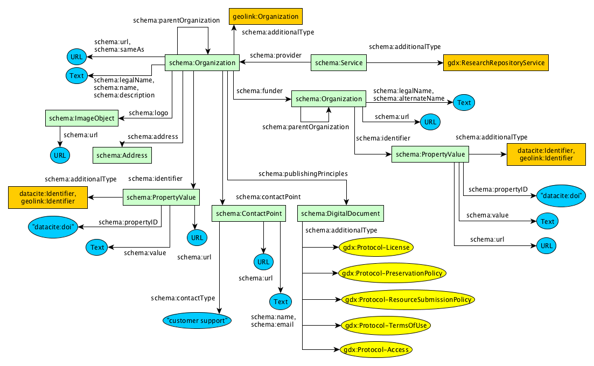

* [About](#about)
* [Goals](#goals)
* [Approach](#approach)
* [Vocabulary Prefixes](#prefixes)
* [Graphical Notation](#graphical-notation)
* [Publishing schema.org JSON-LD](#schemaorg-jsonld)
  * [Describing a Repository](#repository)
    * [Repository - Fields](#repository-fields)
    * [Repository - Offer Catalog](#repository-offercatalog)
    * [Repository - Provider](#repository-provider)
    * [Repository - Services](#repository-services)
  * [Dataset](#dataset-diagram)
    * [Variables](#dataset-variables)
    * [Spatial](#dataset-spatial)
    * [Temporal](#dataset-temporal)
    * [Identifiers](#dataset-identifiers)
    * [Creators/Contributors](#dataset-creator_contributor)
    * [Publisher/Provider](#dataset-publisher_provider)
    * [Distributions](#dataset-distros)
    * [Protocols](#dataset-protocols)
    * [Funding](#dataset-funding)
    * [Deployment]($dataset-deployment)
    * [Project](#dataset-project)
    * [DataCatalog](#dataset-catalog)
* [Examples](#examples)
* [Issues](#issues)

## About

Serves the vocabulary in JSON-LD at https://geodex.org/voc/.

## Goals

1) To produce quality schema.org markup with additional extensions to schema.org classes to help improve harvesting technologies.

2) Produced markup will pass the [Google Structured Data Testing Tool](https://search.google.com/structured-data/testing-tool/u/0/) with 0 errors.

## Approach

The preferred format for schema.org markup by its harvesters is JSON-LD. For a primer on JSON-LD, see [https://json-ld.org/](https://json-ld.org/)

To produce quality schema.org, all extensions to schema.org classes will be made through the use of the recommended property [schema:additionalType](https://schema.org/additionalType). 

The gdx: vocabulary will extend schema.org using rdfs:subClassOf in it's formal ontology, but in schema.org this doesn't translate into the use of JSON-LD's [@type](https://www.w3.org/TR/json-ld/#syntax-tokens-and-keywords) as traditional RDF publishing would encourage.

## Vocabulary Prefixes

| Prefix        | Vocabulary URI |
| ------------- |----------------|
| schema:       | [<https://schema.org/>](https://schema.org/) |
| gdx:          | [<https://geodex.org/voc/>](https://geodex.org/voc/) |
| earthcollab:  | [<https://library.ucar.edu/earthcollab/schema#>](https://library.ucar.edu/earthcollab/schema#) |
| geolink:      | [<http://schema.geolink.org/1.0/base/main#>](http://schema.geolink.org/1.0/base/main#) |
| vivo:         | [<http://vivoweb.org/ontology/core#>](http://vivoweb.org/ontology/core#) |
| geo-upper:    | [<http://www.geoscienceontology.org/geo-upper#>](http://www.geoscienceontology.org/geo-upper#) |
| dbpedia:      | [<http://dbpedia.org/resource/>](http://dbpedia.org/resource/) |
 
[schema:](https://schema.org/) the defacto vocabulary for publishing structured data in web pages for search engine harvesting

[gdx:](https://geodex.org/voc/) the P418 project's vocabulary

[earthcollab:](https://library.ucar.edu/earthcollab/schema#) an EarthCube Building Block focusing on extensions to the ViVO ontology

[vivo:](http://vivoweb.org/ontology/core#) the ViVO ontology

[geo-upper:](http://www.geoscienceontology.org/geo-upper#) a segment of the Geoscience Standard Names Ontology, an EarthCube product

[dbpedia:](http://dbpedia.org/resource/) Structured data for Wikipedia resources

## Graphical Notation

The graphs display the classes, properties and literals for producing valid schema.org markup. 

Back to [top](#top)

## Schema.org JSON-LD

Schema.org's preferred format for markup is JSON-LD.....describe tools that help publish schema.org

## Describing a Repository

Because the organizational and governance structures of all repositories vary, this vocabulary has split apart the *function* of the repository from the organization(s) that operate/provide those functions. 
In schema.org, this *function* is best described as a [schema:Service](https://schema.org/Service), and to uniquely identify repositories curating research products, this vocabulary defines an extension to schema:Service as [gdx:ResearchRepositoryService](https://geodex.org/voc/ResearchRepositoryService).

<pre>
{
  "@context": {
    "@vocab": "http://schema.org/",
    "gdx": "https://geodex.org/voc/"
  },
  <strong>"@type": "Service",
  "additionalType": "gdx:ResearchRepositoryService"</strong>,
  "name": "Sample Data Repository Service",
}
</pre>

The [schema:provider](https://schema.org/provider) property of schema:Service can then be used to describe the [schema:Organization](https://schema.org/Organization).
<pre>
{
  "@context": {
    "@vocab": "http://schema.org/",
    "gdx": "https://geodex.org/voc/"
  },
  "@type": "Service",
  "additionalType": "gdx:ResearchRepositoryService",
  "name": "Sample Data Repository Service",
  <strong>"provider": {
    "@type": "Organization",
    "legalName": "Sample Data Repository Office"
  }</strong>
}
</pre>

If a repository is comprised of multiple organziations, for example a collaborative award to different institutions, multiple [schema:Organization](https://schema.org/Organization) records can be described.
<pre>
{
  "@context": {
    "@vocab": "http://schema.org/",
    "gdx": "https://geodex.org/voc/"
  },
  "@type": "Service",
  "additionalType": "gdx:ResearchRepositoryService",
  "name": "Sample Data Repository Service",
  <strong>"provider": [
    {
      "@type": "Organization",
      "legalName": "Sample Data Repository Office"
    },
    {
      "@type": "Organization",
      "legalName": "Sample Data Repository Technology Operators Office"
    }
  ]</strong>
}
</pre>

### Describing a Repository's Provider(s)

### Describing a Repository's Services

### Describing a Repository's Offer Catalog

Back to [top](#top)

### Dataset

#### Variables

#### Spatial

#### Temporal

#### Identifiers

#### Creators/Contributors

#### Publisher/Provider

#### Distributions

#### Protocols

#### Funding

#### Deployment

#### Project

#### DataCatalog

Back to [top](#top)

### Examples

All examples can be found at: https://github.com/earthcubearchitecture-project418/p418Vocabulary/blob/master/html/examples/

A [minimal record](https://github.com/earthcubearchitecture-project418/p418Vocabulary/blob/master/html/examples/required.jsonld) to satisfy the Research Repository Service.

A [full record](https://github.com/earthcubearchitecture-project418/p418Vocabulary/blob/master/html/examples/full.jsonld).

#### Issues

https://stackoverflow.com/questions/38243521/schema-org-contacttype-validation-issue-the-value-provided-for-office-must-be

Back to [top](#top)
