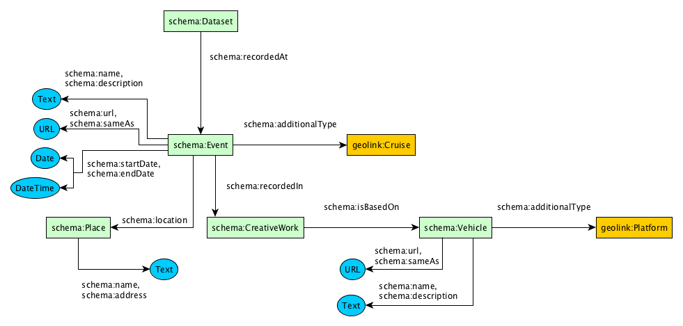
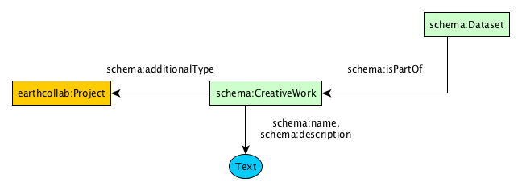

To-do:
* Finish Repository documentation [completed: Jan 12, 2018]
* Finish Dataset documentation

# Table of Contents

* [About](#about)
* [Goals](#goals)
* [Approach](#approach)
* [Vocabulary Prefixes](#prefixes)
* [Graphical Notation](#graphical-notation)
* [Publishing schema.org JSON-LD](#schemaorg-jsonld)
  * [Describing a Repository](#repository)
    * [Repository - Fields](#repository-fields)
    * [Repository - Identifier](#repository-identifier)
    * [Repository - Policies](#repository-policies)
    * [Repository - Services](#repository-services)
    * [Repository - Offer Catalog](#repository-offercatalog)
  * [Dataset](#dataset-diagram)
    * [Variables](#dataset-variables)
    * [Spatial](#dataset-spatial)
    * [Temporal](#dataset-temporal)
    * [Identifiers](#dataset-identifiers)
    * [Creators/Contributors](#dataset-creator_contributor)
    * [Publisher/Provider](#dataset-publisher_provider)
    * [Distributions](#dataset-distros)
    * [Protocols](#dataset-protocols)
    * [Funding](#dataset-funding)
    * [Deployment]($dataset-deployment)
    * [Project](#dataset-project)
    * [DataCatalog](#dataset-catalog)
* [Examples](#examples)
* [Issues](#issues)

## About

Serves the vocabulary in JSON-LD at https://geodex.org/voc/.

## Goals

1) To produce quality schema.org markup with additional extensions to schema.org classes to help improve harvesting technologies.

2) Produced markup will pass the [Google Structured Data Testing Tool](https://search.google.com/structured-data/testing-tool/u/0/) with 0 errors.

## Approach

The preferred format for schema.org markup by its harvesters is JSON-LD. For a primer on JSON-LD, see [https://json-ld.org/](https://json-ld.org/)

To produce quality schema.org, all extensions to schema.org classes will be made through the use of the recommended property [schema:additionalType](https://schema.org/additionalType).

The gdx: vocabulary will extend schema.org using rdfs:subClassOf in it's formal ontology, but in schema.org this doesn't translate into the use of JSON-LD's [@type](https://www.w3.org/TR/json-ld/#syntax-tokens-and-keywords) as traditional RDF publishing would encourage.

## Vocabulary Prefixes

| Prefix        | Vocabulary URI |
| ------------- |----------------|
| schema:       | [<https://schema.org/>](https://schema.org/) |
| gdx:          | [<https://geodex.org/voc/>](https://geodex.org/voc/) |
| earthcollab:  | [<https://library.ucar.edu/earthcollab/schema#>](https://library.ucar.edu/earthcollab/schema#) |
| geolink:      | [<http://schema.geolink.org/1.0/base/main#>](http://schema.geolink.org/1.0/base/main#) |
| vivo:         | [<http://vivoweb.org/ontology/core#>](http://vivoweb.org/ontology/core#) |
| geo-upper:    | [<http://www.geoscienceontology.org/geo-upper#>](http://www.geoscienceontology.org/geo-upper#) |
| datacite      | [<http://purl.org/spar/datacite/>](http://purl.org/spar/datacite/) |
| dbpedia:      | [<http://dbpedia.org/resource/>](http://dbpedia.org/resource/) |

[schema:](https://schema.org/) the defacto vocabulary for publishing structured data in web pages for search engine harvesting

[gdx:](https://geodex.org/voc/) the P418 project's vocabulary

[earthcollab:](https://library.ucar.edu/earthcollab/schema#) an EarthCube Building Block focusing on extensions to the ViVO ontology

[vivo:](http://vivoweb.org/ontology/core#) the ViVO ontology

[geo-upper:](http://www.geoscienceontology.org/geo-upper#) a segment of the Geoscience Standard Names Ontology, an EarthCube product

[datacite:](http://purl.org/spar/datacite/) describes persistent identifier schemes like DOI, ARK, URI for helping to represent PIDs. 

[dbpedia:](http://dbpedia.org/resource/) Structured data for Wikipedia resources

## Graphical Notation

The graphs display the classes, properties and literals for producing valid schema.org markup.

Back to [top](#top)

## Schema.org JSON-LD

Schema.org's preferred format for markup is JSON-LD. THere are a number of tools that will help build valid schema.org JSON-LD.
* Web UI for constructing schema.org: [https://schema.pythonanywhere.com/](https://schema.pythonanywhere.com/)
  * Jumpstart into specific Types:
    * [Service](https://schema.pythonanywhere.com/Service)
    * [Organization](https://schema.pythonanywhere.com/Organization)
      * [ContactPoint](https://schema.pythonanywhere.com/ContactPoint)
      * [PropertyValue](https://schema.pythonanywhere.com/PropertyValue) aka Identifier
    * [DigitalDocument](https://schema.pythonanywhere.com/DigitalDocument)
    * [OfferCatalog](https://schema.pythonanywhere.com/OfferCatalog)
    * [ServiceChannel](https://schema.pythonanywhere.com/ServiceChannel)
      * [Service](https://schema.pythonanywhere.com/Service)
    * [Dataset](https://schema.pythonanywhere.com/Dataset)
      * [DataDownload](https://schema.pythonanywhere.com/DataDownload)
      * [DataCatalog](https://schema.pythonanywhere.com/DataCatalog)
      * [Person](https://schema.pythonanywhere.com/Person) aka Author/Contributor
      * [Organization](https://schema.pythonanywhere.com/Organization) aka Publisher, Provider, Funder
      * [Place](https://schema.pythonanywhere.com/Place)
        * [GeoShape](https://schema.pythonanywhere.com/GeoShape)
        * [GeoCoordinates](https://schema.pythonanywhere.com/GeoCoordinates)
      * [PropertyValue](https://schema.pythonanywhere.com/PropertyValue) aka Variable, Identifier
      * [Event](https://schema.pythonanywhere.com/Event)
        * [CreativeWork](https://schema.pythonanywhere.com/CreativeWork)
          * [Vehicle](https://schema.pythonanywhere.com/Vehicle)
      
* Google Testing Tool for schema.org: [https://search.google.com/structured-data/testing-tool/u/0/](https://search.google.com/structured-data/testing-tool/u/0/)
  * Error Guide: [https://www.schemaapp.com/tips/structured-data-testing-tool-error-guide/](https://www.schemaapp.com/tips/structured-data-testing-tool-error-guide/)

## Describing a Repository

In schema.org, we model a repository as both an [schema:Organization](https://schema.org/Organization) and a [schema:Service](https://schema.org/Service). This double-typing gives us the most flexibility in describing the characteristics of the organization providing the service and the services offered by the organization. Becuase the Service class in schema.org is very broad, to uniquely identify repositories curating research products, this vocabulary defines an extension to [schema:Service](https://schema.org/Service) as [gdx:ResearchRepositoryService](https://geodex.org/voc/ResearchRepositoryService).

<pre>
{
  "@context": {
    "@vocab": "http://schema.org/",
    "gdx": "https://geodex.org/voc/"
  },
  <strong>"@type": ["Service", "Organization"],
  "additionalType": "gdx:ResearchRepositoryService"</strong>,
  "legalName": "Sample Data Repository Office",
  "name": "SDRO"
  </strong>
}
</pre>

The other fields you can use to describe the Organziation and the Service are: 

* [schema:legalName](https://schema.org/legalName) should be the official name of the  repository, 
* [schema:name](https://schema.org/name) can be an acronym or the name typcially used for the repository, 
* [schema:url](https://schema.org/url) should be the url of your repository's homepage, 
* [schema:description](https://schema.org/description) should be text describing your repository, 
* [schema:category](https://schema.org/category) can be used to describe the discipline, domain, area of study that encompasses the repository's holdings. 

<pre>
{
  "@context": {
    "@vocab": "http://schema.org/",
    "gdx": "https://geodex.org/voc/"
  },
  "@type": ["Service", "Organization"],
  "additionalType": "gdx:ResearchRepositoryService",
  "legalName": "Sample Data Repository Office",
  "name": "SDRO",
  <strong>"url": "https://www.sample-data-repository.org",
  "description": "The Sample Data Repository Service provides access to data from an imaginary domain accessible from this website.",
  "category": [
    "Biological Oceanography",
    "Chemical Oceanography"
  ]
  </strong>
}
</pre>

(See [advanced publishing techniques](#advanced-publishing) for how to [describe categories/disciplines in more detail](#advanced-publishing-category) than just simple text.)

If you are using the "@id" attribute for your Repository, you can specify the [schema:provider](https://schema.org/provider)  of the [schema:Service](https://schema.org/Service) in this way:
<pre>
{
  "@context": {
    "@vocab": "http://schema.org/",
    "gdx": "https://geodex.org/voc/"
  },
  "@type": ["Service", "Organization"],
  <strong>"@id": "https://www.sample-data-repository.org",</strong>
  "additionalType": "gdx:ResearchRepositoryService",
  "legalName": "Sample Data Repository Office",
  "name": "SDRO",
  "url": "https://www.sample-data-repository.org",
  "description": "The Sample Data Repository Service provides access to data from an imaginary domain accessible from this website.",
  "category": [
    "Biological Oceanography",
    "Chemical Oceanography"
  ],
  <strong>"provider": {
    "@id": "https://www.sample-data-repository.org"
  }</strong>
}
</pre>

However, if your repository has a situation where multiple organizations act as the provider or you want to recognize a different organization as the provider of the repository's service, [schema:provider](https://schema.org/provider) can be used in this way:

<pre>
{
  "@context": {
    "@vocab": "http://schema.org/",
    "gdx": "https://geodex.org/voc/"
  },
  "@type": ["Service", "Organization"],
  "additionalType": "gdx:ResearchRepositoryService",
  "legalName": "Sample Data Repository Office",
  "name": "SDRO",
  "url": "https://www.sample-data-repository.org",
  "description": "The Sample Data Repository Service provides access to data from an imaginary domain accessible from this website.",
  "category": [
    "Biological Oceanography",
    "Chemical Oceanography"
  ],
  <strong>"provider": [
    {
      "@type": "Organization",
      "name": "SDRO Technical Office",
      "description": "We provide all the infrastructure for the SDRO"
      ...
    },
    {
      "@type": "Organization",
      "name": "SDRO Science Support Office",
      "description": "We provide all the science support functionality for the SDRO"
      ...
    }
  ]</strong>
}
</pre>

Adding additional fields of [schema:Organization](https://schema.org/Organization):

<pre>
{
  "@context": {
    "@vocab": "http://schema.org/",
    "gdx": "https://geodex.org/voc/"
  },
  "@type": ["Service", "Organization"],
  "additionalType": "gdx:ResearchRepositoryService",
  "legalName": "Sample Data Repository Office",
  "name": "SDRO",
  "url": "https://www.sample-data-repository.org",
  "description": "The Sample Data Repository Service provides access to data from an imaginary domain accessible from this website.",
  "category": [
    "Biological Oceanography",
    "Chemical Oceanography"
  ],
  "provider": {
    "@id": "https://www.sample-data-repository.org"
  }
  <strong>"logo": {
    "@type": "ImageObject",
    "url": "https://www.sample-data-repository.org/images/logo.jpg"
  },
  "contactPoint": {
    "@type": "ContactPoint",
    "name": "Support",
    "email": "info@bco-dmo.org",
    "url": "https://www.sample-data-repository.org/about-us",
    "contactType": "customer support"
  },
  "foundingDate": "2006-09-01",
  "address": {
    "@type": "PostalAddress",
    "streetAddress": "123 Main St.",
    "addressLocality": "Anytown",
    "addressRegion": "ST",
    "postalCode": "12345",
    "addressCountry": "USA"
  }</strong>
}
</pre>

If this Organization has a parent entity such as a college, university or research center, that information can be provided using the [schema:parentOrganization](https://schema.org/parentOrganization) property:

<pre>
{
  "@context": {
    "@vocab": "http://schema.org/",
    "gdx": "https://geodex.org/voc/"
  },
  "@type": ["Service", "Organization"],
  "additionalType": "gdx:ResearchRepositoryService",
  "legalName": "Sample Data Repository Office",
  "name": "SDRO",
  "url": "https://www.sample-data-repository.org",
  "description": "The Sample Data Repository Service provides access to data from an imaginary domain accessible from this website.",
  "category": [
    "Biological Oceanography",
    "Chemical Oceanography"
  ],
  "provider": {
    "@id": "https://www.sample-data-repository.org"
  },
   <strong>"parentOrganization": {
     "@type": "Organization",
     "@id": "http://www.someinstitute.edu",
     "legalName": "Some Institute",
     "name": "SI",
     "url": "http://www.someinstitute.edu",
     "address": {
       "@type": "PostalAddress",
       "streetAddress": "234 Main St.",
       "addressLocality": "Anytown",
       "addressRegion": "ST",
       "postalCode": "12345",
       "addressCountry": "USA"
     }
   }</strong>
  }
}
</pre>

### Describing a Repository's Identifier

#repository-provider-identifier
Some organizations may have a persistent identifier (DOI) assigned to their organization from authorities like the Registry of Research Data Repositories (re3data.org). The way to describe these organizational identifiers is to use the [schema:identifier](https://schema.org/identifier) property in this way:

<pre>
{
  "@context": {
    "@vocab": "http://schema.org/",
    "gdx": "https://geodex.org/voc/",
    <strong>"datacite": "http://purl.org/spar/datacite/"</strong>
  },
  "@type": ["Service", "Organization"],
  "additionalType": "gdx:ResearchRepositoryService",
  "legalName": "Sample Data Repository Office",
  "name": "SDRO",
  "url": "https://www.sample-data-repository.org",
  "description": "The Sample Data Repository Service provides access to data from an imaginary domain accessible from this website.",
  "category": [
    "Biological Oceanography",
    "Chemical Oceanography"
  ],
  "provider": {
    "@id": "https://www.sample-data-repository.org"
  },
  <strong>"identifier": {
    "@type": "PropertyValue",
    "name": "Re3data DOI for this repository",
    "propertyID": "datacite:doi",
    "value": "10.17616/R37P4C",
    "url": "http://doi.org/10.17616/R37P4C"
  }</strong>
}
</pre>

We add the `datacite` vocabulary to the `@context` because the Datacite Ontology available at [http://purl.org/spar/datacite/](http://purl.org/spar/datacite/) has URIs to describe a DOI, ORCiD, ARK, URI, URN - all identifier scheme that help for disamiguating identifiers. To properly disambiguate a globally unique identifier, 2 pieces of information are needed - 1) the identifier value and 2) the scheme that on which that identifier exists. Some examples of this concept for common identifiers  are:

| Scheme | Value |
| ------ | ----- |
| DOI    | 10.17616/R37P4C |
| ORCiD  | 0000-0002-6059-4651 |

When describing PIDs, it's important to include both of these pieces for downstream activities like searching and linking resources. FOor example, a user may want to query for all repositories with a DOI identifier or all Datasets authored by a researcher with an ORCiD. These types of filters become more difficult when only the URL to these identifiers are provided. The reason here is that there are multiple URLs for an persistent identifier. On example is the DOI:

* http://doi.org/10.17616/R37P4C
* https://doi.org/10.17616/R37P4C
* http://dx.doi.org/10.17616/R37P4C
* https://dx.doi.org/10.17616/R37P4C

So, the best practice is to provide the scheme and value for an identifier, but you can also provide a URL representation using the [schema:url](https://schema.org/url) property.

### Describing a Repository's Policies

If your repository has policy documents about access control, terms of use, etc. You can provide those using the [schema:publishingPrinciples](https://schema.org/publishingPrinciples) field. Becuase schema.org does not make a distiction for the types of these documents, P418 has created some class names for some common policy document types. THese will help make it clear to users what types of policies you have. If you would like us to add more, please let us know by creating an [Issue](https://github.com/earthcubearchitecture-project418/p418Vocabulary/issues/new).

<pre>
{
  "@context": {
    "@vocab": "http://schema.org/",
    "gdx": "https://geodex.org/voc/",
    "datacite": "http://purl.org/spar/datacite/"
  },
  "@type": ["Service", "Organization"],
  "additionalType": "gdx:ResearchRepositoryService",
  "legalName": "Sample Data Repository Office",
  "name": "SDRO",
  "url": "https://www.sample-data-repository.org",
  ...
  <strong>"publishingPrinciples": [
      {
        "@type": "DigitalDocument",
        "additionalType": "gdx:Protocol-TermsOfUse",
        "name": "Terms of Use",
        "url": "https://www.sample-data-repository.org/terms-of-use",
        "fileFormat": "text/html"
      },
      {
        "@type": "DigitalDocument",
        "additionalType": "gdx:Protocol-ResourceSubmissionPolicy",
        "name": "How to Get Started Contributing Data",
        "url": "https://www.sample-data-repository.org/submit-data",
        "fileFormat": "text/html"
      }
    ],
  ]</strong>
}
</pre>

### Describing a Repository's Services

For repositories might offer services for accessing data as opposed to directly accessing data files. The [schema:Service](https://schema.org/Service) allows us to describe these services as well as repository searches, data submission services, and syndication services. In this first example, we describe a search service at the repository using [schema:ServiceChannel](https://schema.org/ServiceChannel).

<pre>
{
  "@context": {
    "@vocab": "http://schema.org/",
    "gdx": "https://geodex.org/voc/",
    "datacite": "http://purl.org/spar/datacite/"
  },
  "@type": ["Service", "Organization"],
  "additionalType": "gdx:ResearchRepositoryService",
  "legalName": "Sample Data Repository Office",
  "name": "SDRO",
  "url": "https://www.sample-data-repository.org",
  ...
  <strong>"availableChannel": [
    {
      "@type": "ServiceChannel",
      "serviceUrl": "https://www.sample-data-repository.org/search",
      "providesService": {
        "@type": "Service",
        "additionalType": "gdx:SearchService",
        "name": "SDRO Website Search",
        "description": "Search for webpages, datasets, authors, funding awards, instrumentation and measurements",
        "potentialAction": {
          "@type": "SearchAction",
          "target": "https://www.sample-data-repository.org/search?keywords={query_string}",
          "query-input": {
            "@type": "PropertyValueSpecification",
            "valueRequired": true,
            "valueName": "query_string"
          }
        }
      }
    }</strong>,
    {
       "@type": "ServiceChannel",
       "serviceUrl": "https://www.sample-data-repository.org/sitemap.xml",
       "providesService": {
         "@type": "Service",
         "additionalType": "gdx:SyndicationService",
         "name": "Sitemap XML",
         "description": "A Sitemap XML providing access to all of the resources for harvesting",
         "potentialAction": {
           "@type": "ConsumeAction",
           "target": {
             "@type": "EntryPoint",
             "additionalType": "gdx:SitemapXML",
             "url": "https://www.sample-data-repository.org/sitemap.xml",
             "urlTemplate": "https://www.sample-data-repository.org/sitemap.xml?page={page}"
           },
           "object": {
             "@type": "DigitalDocument",
             "url": "https://www.sample-data-repository.org/sitemap.xml",
             "fileFormat": "application/xml"
           }
         }
       }
     }
  ]
}
</pre>

By specifying the [schema:potentialAction(https://schema.org/potentialAction), we create a machine-actionable way to execute searches. This means that an EarthCube Registry could take a user submitted query, and pass it along to the repository for the EarthCube Registry user.

If your repository does have datasets or other resources with schema.org JSON-LD markup on their landing pages, Google recommends that all URLs be put inside a sitemap.xml file. To create a sitemap.xml, [go here](https://www.google.com/schemas/sitemap/0.84/). To describe your sitemap.xml, add a [schema:ServiceChannel](https://schema.org/ServiceChannel) similar to the following markup:

<pre>
{
  "@context": {
    "@vocab": "http://schema.org/",
    "gdx": "https://geodex.org/voc/",
    "datacite": "http://purl.org/spar/datacite/"
  },
  "@type": ["Service", "Organization"],
  "additionalType": "gdx:ResearchRepositoryService",
  "legalName": "Sample Data Repository Office",
  "name": "SDRO",
  "url": "https://www.sample-data-repository.org",
  ...
  "availableChannel": [
    {
      "@type": "ServiceChannel",
      "serviceUrl": "https://www.sample-data-repository.org/search",
      "providesService": {
        "@type": "Service",
        "additionalType": "gdx:SearchService",
        "name": "SDRO Website Search",
        "description": "Search for webpages, datasets, authors, funding awards, instrumentation and measurements",
        "potentialAction": {
          "@type": "SearchAction",
          "target": "https://www.sample-data-repository.org/search?keywords={query_string}",
          "query-input": {
            "@type": "PropertyValueSpecification",
            "valueRequired": true,
            "valueName": "query_string"
          }
        }
      }
    },
    <strong>{
       "@type": "ServiceChannel",
       "serviceUrl": "https://www.sample-data-repository.org/sitemap.xml",
       "providesService": {
         "@type": "Service",
         "additionalType": "gdx:SyndicationService",
         "name": "Sitemap XML",
         "description": "A Sitemap XML providing access to all of the resources for harvesting",
         "potentialAction": {
           "@type": "ConsumeAction",
           "target": {
             "@type": "EntryPoint",
             "additionalType": "gdx:SitemapXML",
             "url": "https://www.sample-data-repository.org/sitemap.xml",
             "urlTemplate": "https://www.sample-data-repository.org/sitemap.xml?page={page}"
           },
           "object": {
             "@type": "DigitalDocument",
             "url": "https://www.sample-data-repository.org/sitemap.xml",
             "fileFormat": "application/xml"
           }
         }
       }
     }</strong>
  ]
}
</pre>

### Describing a Repository's Offer Catalog

If your repository has some number of data collections, and you would like to represent those collections the [schema:DataCatalog](https://schema.org/DataCatalog) allows us to describe these collections and the [schema:OfferCatalog](https://schema.org/OfferCatalog).links those to the repository service.

<pre>
{
  "@context": {
    "@vocab": "http://schema.org/",
    "gdx": "https://geodex.org/voc/",
    "datacite": "http://purl.org/spar/datacite/"
  },
  "@type": ["Service", "Organization"],
  "additionalType": "gdx:ResearchRepositoryService",
  "legalName": "Sample Data Repository Office",
  "name": "SDRO",
  "url": "https://www.sample-data-repository.org",
  ...
  <strong>"hasOfferCatalog": {
    "@type": "OfferCatalog",
    "name": "Sample Data Repository Resource Catalog",
    "itemListElement": [
      {
        "@type": "DataCatalog",
        "@id": "https://www.sample-data-repository.org/collection/biological-data",
        "name": "Biological Data",
        "audience": {
          "@type": "Audience",
          "audienceType": "public",
          "name": "General Public"
        }
      },
      {
        "@type": "DataCatalog",
        "@id": "https://www.sample-data-repository.org/collection/geological-data",
        "name": "Geological Data",
        "audience": {
          "@type": "Audience",
          "audienceType": "public",
          "name": "General Public"
        }
      }
    ]
  }</strong>
}
</pre>

Back to [top](#top)

### Dataset

#### Variables

#### Spatial

#### Temporal

#### Identifiers

#### Creators/Contributors

#### Publisher/Provider

#### Distributions

#### Protocols

#### Funding

#### Deployment

#### Project

#### DataCatalog

Back to [top](#top)

### Examples

All examples can be found at: https://github.com/earthcubearchitecture-project418/p418Vocabulary/tree/master/html/voc/static/schema/examples/

* [Repository Examples](https://github.com/earthcubearchitecture-project418/p418Vocabulary/tree/master/html/voc/static/schema/examples/repository)
  * [Full Example by BCO-DMO](https://github.com/earthcubearchitecture-project418/p418Vocabulary/blob/master/html/voc/static/schema/examples/repository/full.jsonld)
  * [Minimal Example by BCO-DMO](https://github.com/earthcubearchitecture-project418/p418Vocabulary/blob/master/html/voc/static/schema/examples/repository/minimal.jsonld)
  * See [BCO-DMO homepage](https://www.bco-dmo.org) (view source of the page to see the schema.org JSON-LD)
* [Dataset Examples](https://github.com/earthcubearchitecture-project418/p418Vocabulary/tree/master/html/voc/static/schema/examples/resource)

#### Issues

https://stackoverflow.com/questions/38243521/schema-org-contacttype-validation-issue-the-value-provided-for-office-must-be

### Advanced Publishing Techniques

#### How to publish resources for the categories/disciplines at repository services.

The SWEET ontology defines a number of science disciplines and a repository could reference those, or another vocabuary's resources, by adding the vocabular to the `@context` attribute of the JSON-LD markup. 

<pre>
{
  "@context": {
    "@vocab": "http://schema.org/",
    "gdx": "https://geodex.org/voc/",
    <strong>"sweet-rel": "http://sweetontology.net/rela/",
    "sweet-kd": "http://sweetontology.net/humanKnowledgeDomain/"</strong>
  },
  "@type": ["Service", "Organization"],
  "additionalType": "gdx:ResearchRepositoryService",
  "legalName": "Sample Data Repository Office",
  "name": "SDRO",
  "url": "https://www.sample-data-repository.org",
  "description": "The Sample Data Repository Service provides access to data from an imaginary domain accessible from this website.",
  <strong>"sweet-rel:hasRealm": [
    { "@id": "sweet-kd:Biogeochemistry" },
    { "@id": "sweet-kd:Oceanography" }
  ]
  </strong>
}
</pre>

Back to [top](#top)
